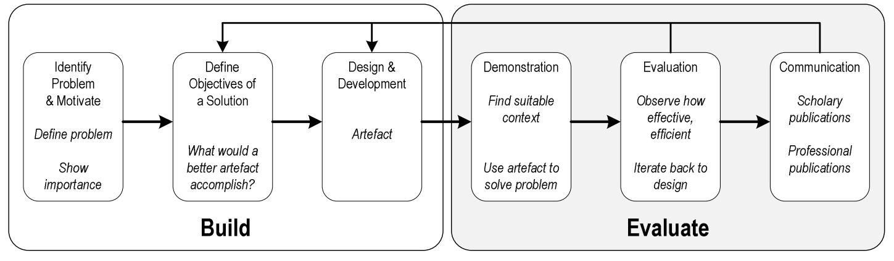

# **Design Science Research**
Philipp Kurrle

<!--

footer: Bild: https://learning.wellingtoncollege.org.uk/wp-content/uploads/2016/09/research.jpg
-->

---

# Was ist Design Science Research?  

- Die in meiner Arbeit angewendete Forschungsmethode folgt dem gestaltungsorientierten Forschungsansatz (eng. **Design-Science-Research** (DSR)) (1)
- DSR ist ein Forschungsparagdimga, bei welchen der Designende Fragen für Probleme beantwortet, indem er Artefakte erschafft und mithilfe dieser neue wissenschaftliche Erkenntnisse generiert werden können. 
- Die entworfenen Artefakte sind sowohl nützlich als auch grundlegend für das Verständnis des Problems (2)

<!--
footer: 1 (Rennenkampff et al., 2015, S. 17), 2 (Hevner & Chatterjee, 2010, S. 10)
-->

---
# Artefakt

- Der Begriff des Artefaktes ist absichtlich weit gefasst und kann verschiedenste Formen annehmen.
- In meiner Arbeit wird das Artefakt wahrscheinlich eine App oder ein ANN (Artificial Neural Network) sein.  
-  Kenntnisse werden Analyse dessen Performance gewonnen.

<!--

footer: Bild: https://myloview.de/sticker-developing-programming-and-coding-technologies-programmer-inspecting-nr-9668083
-->

---

# Aufbau der Thesis 1

1. **Einleitung**
    1.1 Motivation	
    1.2 Ziele und Forschungsfrage
2. **Theoretische Grundlagen**
2.1 Thema 1  
2.2 Thema 2 
3. **Forschungsmethode**
3.1 Design Principles	
3.2 Evaluierung von Softwarearchitekturen	

<!--
footer: ''  
-->

---
4. **Errichtung**
4.1 Problemidentifizierung	
4.2 Entwicklung des Artefakts	
4.3 Beschreibung des Artefakts	
4.4 Demonstration	

5. **Evaluation**
5.1 Perfomance des Artefakts (...)
5.X Ergebnis und Interpretation	
6. **Fazit und Ausblick**
7. **Quellen**

<!--
footer: ''  
-->
---

# Aufbau der Thesis  2

 

<!--
footer: 'Quelle: Sonnenberg & vom Brocke, 2012, S. 72)
Bild: Design Science Research Prozess nach (Peffers et al., 2007, S. 45–77)'  
-->

---

# Beispiel
- **Thema der Arbeit:** Ermittlung von Biegeeigenschaften unbekannter Materialien mittels eines Artificial Neural Networks.
- **Problemidentifizierung:** Keine Daten für Biegeeigenschaften bestimmer Materialien. Messen ist aufwändig -> teuer. 
- **Forschungsfrage:** Kann ein ANN anhand historischer Daten die Biegeeigenschaften ermitteln? 
- **Artefakt:** Das ANN 

---

