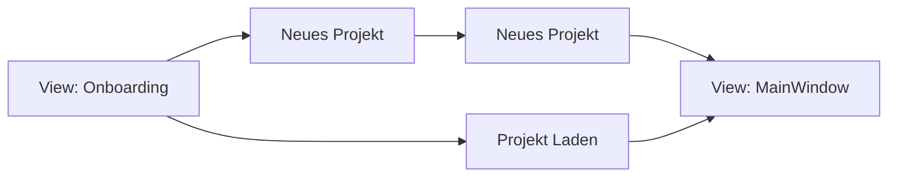
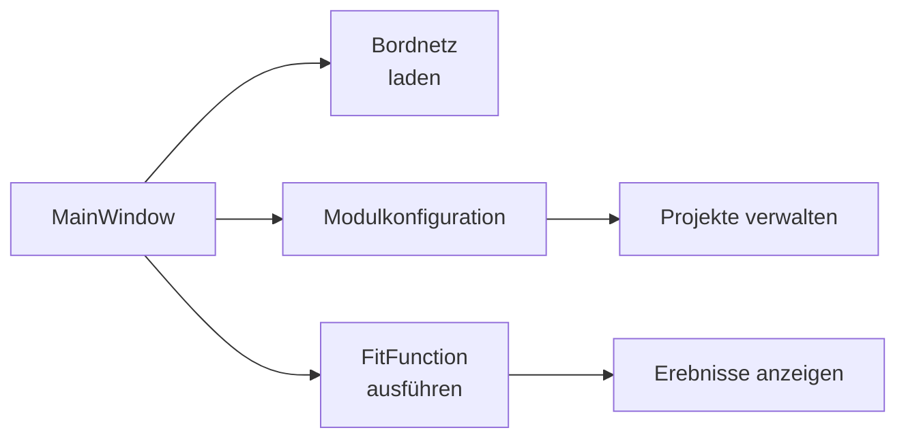

# HarCon GUI
Refs: [[HaRCon_General]]
Tags: #gui #concept-notes 

---

# Featues
- Importieren von Bordnetz-Daten
	- EbaContainer
	- SysVec
- FitFunctions
	- FitFunctions ausführen
	- FitFunctions gewichten
	- FitFunctions zusammenstellen
- Module 
	- Module auswählen
	- Projekt speichern und laden

# UI 
- Wizard / On-boarding
	- Sys, BN, Modulconfig / Projekt

- Andre würde Modulconfug in als Menüpunkt machen
- Ergebnis als weiterer Tab
- Mehrere Ergebnisreiter möglich 

 - Nur das modellieren was wir gerade brauchen
 
![[Whiteboard1.png]]
![[Whiteboard2.png]]

# Statusrunde 27.11.2020
 - Statt Flieder Porsche
	 - Farben an CLI anpassen
 - Was ist die basis von JFoenix?
 - Mehr platz noch oben und unten
 - Filterfunktion für FitFunctions
 - FitFunctions an erste Stelle, dann Modulkonfig
 - Welche Funktion wird in Ergebnissen angezeigt? 
	 - Selektierte Funktion hervorheben
 - Split-View für fitfunctions
 - Man braucht nur eine neue Spalte mit Fit-Werten für neue fitfunctions
	 - Suchfunktion für Ergebnisse -> Bestimmte stecker suchen 
 - 

# Vorstellung Mockups
![[1Onboarding1.png]]

![[2Onboarding2.png]]

![[Daten.png]]

![[Ergebnisse.png]]

![[Module.png]]

# Workflows 
## Onboarding
Beim Start der Software kann entscheiden werden ob ein ein bereits bestehendes Projekt geladen wird oder ob ein neues Projekt geladen werden soll. 
Wenn ein neus Projekt erstellt wird kann sowohl ein eba-container als auch eine .vec Datei geladen werden. 

[[Module.png]]

## MainWindow
Im MainWindow sind folgende Featues verfügbar (02.12.2020)
- Bordnetzdaten laden (EBA und Sys)
- Modukonfiguration
- Projekte verwalten
- FitFunctions ausführen
- Ergebnisse anzeigen (und vergleichen): 

Der MainWindow-View öffnet sich nur wenn bereits Bordnetzdaten geladen sind. Sollte entweder Eba- oder Sys-Daten nicht eingeladen sein öffent sich das Onboarding. 
Im View "Modulkonfiguraion" können Module ausgewählt werden und in einem Projekt gespeichert werden. Ein Projekt enhtält die Bordnetzdaten sowie die ausgewählten Module. 

Im View "FitFunctions" können FitFunctions ausgeführt werden. Diese werden auf die eingeladenen Daten agnewendet. Anschließend öffnet sich der "Ergebnisse-View". 

## Farben
![[PorscheFarbpalette.png]]

Primärfarbe: 
- Porsche rot (#d5001c)

Textfarbe: 
- Schwaz (#000000)

Weitere Farben: 
- Grau1 (#dad9de) 
 - Grau2 (#b5b4ba)
 - Grau3 (#737278)
 - Grau4 (#403f45) 

Weitere Farben sollte sie gebraucht werden: 
![[PorscheWeitereFarben.png]]

### Update 

## UI Workshop
- Ergebnisansicht als Zentrum der Applikation
 

# Mockup 1 Breadcrumps
 - Breadrumps hierarchie hervorheben
 - Nur zurück navigieren
 - Ganz links immer home/root 
 - Ganz links könnte Zeilge weg fallen
- Schatierung der haupansicht anders

# Mockup 2 Navigations vs. Feature
- Wie kann man trennen zwischen menü und navigations elemente
	- Pfeile oder in der Ansicht selbst

# Mockup 3 Wizard
- Wizard mit menü links und ohne menü links
- Als popup
- unterhalb der hauptleiste 

# Dialogs

