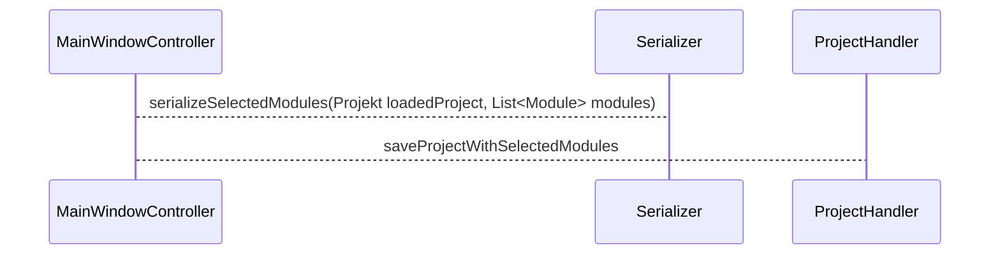
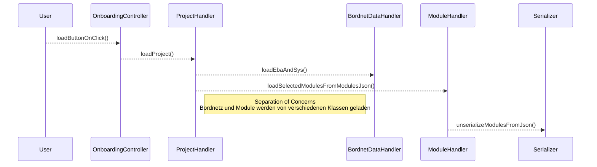

[[HaRCon_General]]

# Selektirere Module speichern und laden 

## Selektiere Module speichern

- Selektierte Module werden im `Roaming/harcon/temp/selected-modules.json` gespeichert. 
- Anschließend muss das entsprechende Projekt entpackt und mit der  `selected-modules.json` neu verpackt werden. Das alte zip-Archiv wird gelöscht. 
- `saveProjectWithSelectedModules(String projectName`
	- unZip(projectName)
	- zip()
		- eba.zip
		- sys.sys
		- modules.json
	- deleteOldProjectArchive
		

## Selektierte Module laden 

