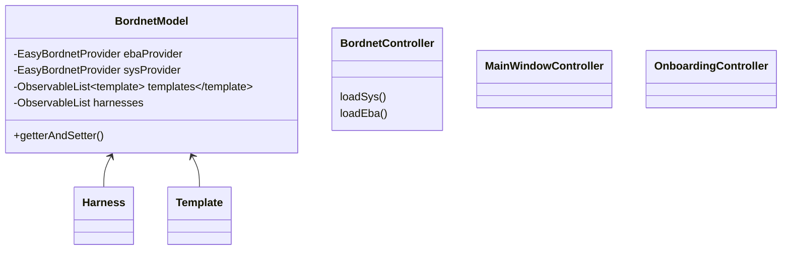

Refs: [[HaRCon_General]]

# How do I implement MVC with the bordnet data? 

```mermaid
classDiagram
	BordnetModel <-- Harness
	BordnetModel <-- Template
	
	class BordnetModel {
		-EasyBordnetProvider ebaProvider
		-EasyBordnetProvider sysProvider
		
		-ObservableList<Template> templates
		-ObservableList<Harness> harnesses
		
		+getterAndSetter()
	}
	
	
	class BordnetController { 
		loadSys()
		loadEba()
		
	}
	
	class MainWindowController { 
	}
	
	class OnboardingController { 
	}
	
	class Harness { 
	}
	
	class Template{ 
	}
	


```

BordnetData
- hold EeasyBordnetzProviders
- holds harnesses, templates 
- load Sys, load eba
-  

