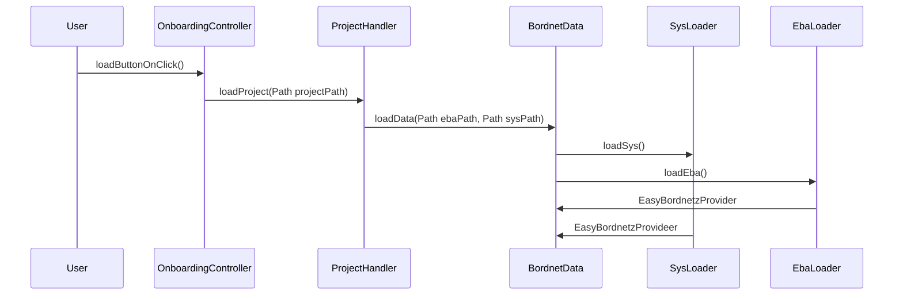

Refs: [[HaRCon_General]] [[Harcon - Ausgewählte Module speichern]]

# Alte Version

# Notes 
- Projekte werden als .zip Datei unter `AppData/Local/Porsche/harcon/v.1.0/` abgelegt. 
- Projekte enthalten:
	- eba-container (.zip)
	- Sys-Vec (.sys)
		- Kann aber auch als .vec eigelesen werden und wird dann automatisch umbenannt.
	- Module (.json) (optional)
- Ein Projekt kann mit oder ohne Module gealden werden. 
--- 
- Wenn ein Projekt geladen wird, wird die .zip Datei in den `input` Ordner verschoben und dort entpackt.

# Neue Version 
Ich habe später die Projektverwaltung deutlich vereinfacht. Jetzt werden nur noch die relevanten files in einen ordner gespeichert und aus diesem auch wieder geladen. 

