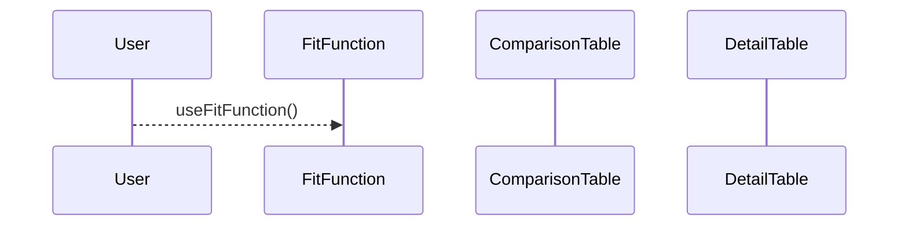
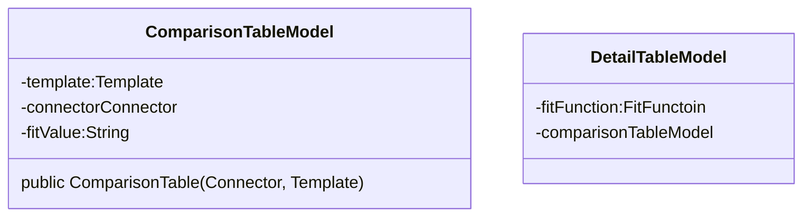

Refs:  [[]]

# Aufbau
- Zwei Tabellen:
	- Vergleichstabelle - `ConnectorName`, `Templatenname` und `FitValue`. 
	- Detailtabelle - Detailansicht, anders je nach FitFunction

# Implementation
- ComparisonTable(String)
- DetailTable(String)
	- Muss dynamisch sein. 

	
	
