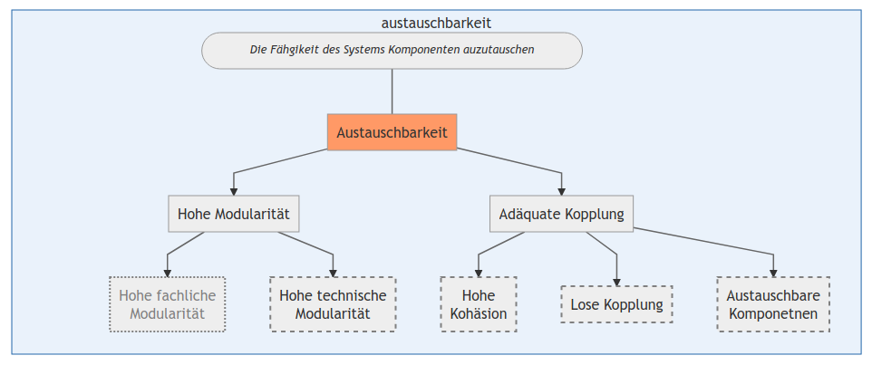

# Theoreische Grundlagen
## Agilität
[...]

Rennkammpf et al. (2015) Sieht die Anwendungslandschaft als Teil der IT-Architektur, allerdings lassen sich die Ziele für Agilität auch auf Software Architekturen übertragen. 

[...]

## Hohe funktionale Agilität der Anwendungslandschaft
Die Architektur muss in der lage sein funktionale Änderungen an ihren Elementen schnell und effizien zu absorbieren. Die Änderungen sollten einfach und schnell umgesetzt werden können. Die steigende Zahl an Anforderungen an eine Anwenung sowie die die alterende uind wachsene Anwendungslanschaft stellen Unternehmen vor Herausfoerungen. 
Um eine hohe funktionale Agilität zu erreich sind zwei Unterziele von Bedeutung: Eine geringe Komplexität und eine hohe Konsistenz der Anwendungslandschaft [@rennenkampffManagementITAgilitaetEntwicklung2015, p.156].

**Geringe Komplexität** Hohe Komplexität ist einer der zentralen Verhinderer von Agilität [@dernITArchitekturGovernanceAufBasis2009]. Monolithische und historisch gewachsene und dadurch komplexe Anwendungssysteme sind schwer wartbar und änderbar und können daher veränderte Geschäftsprozesse nicht mehr abbilden. Hinzu kommen viele weitere Faktoren wie der Einsatz von alten Technologien für die nur noch schwer qualifizierte Mitarbeiter zu finden sind. 

Die Komplexität kann aus theoretisher Sicht auf Basis der allgemeinen Sytemtheorie beschrieben werden. Darunter wird unter einem System "eine Menge von Komponenten verstanden, die miteinenader in Beziehung stehen." [@ferstlGrundlagenWirtschaftsinformatik2013]. Es scheint intuitiv dass ein System mit wenigen Komponenten eine geringer Komplexität als ein System mit vielen Komponenten aufweist.
Die Komplexität eines Systems kann durch drei Eigenschaften bestimmt werden: Die Anzahl der Elementes eines Systems, deren Abhängigkeiten untereinander sowie die Unterschidlichkeit der Elemente [@dernITArchitekturGovernanceAufBasis2009, p.670-671] [@schnebergerComplexityCrossImplications2003, p.217]. Daraus lassen sich nach Rennkampf (2015) die zwei Subziele ableiten: "Geringe Abhängigkeiten" und "Hohe Homogenität" wobei die Anzahl der Systemelemente in die Gwichten des Subziels der "Geringen Abhängigkeiten" einfließt.
[@rennenkampffManagementITAgilitaetEntwicklung2015, p.157].

**Subziel: Geringe Abhängigkeiten**
Anhänigigkeiten enstehen durch die Verbindung von Teilen des Systems durch Schnittestellen. Ahängikgeiten führen dazu, dass die Änderung an einem Teil des Systems andere Teile des Systems beinflusst. Eine maximale Abhängigkeit liegt vor, wenn Anwendungssysteme paarweise miteinander verbunden sind, eine minimale Abhäniggkeit liegt dann vor, wenn ekine Verbindungen existieren [@dernITArchitekturGovernanceAufBasis2009a, p.670-671]. Je höhter die Abhängigkeite in dem System sind, desto schwieriger wird die Umsetzung von Änderungen, da für jede Änderung die Auswirkung auf wetiere Komponenten beachtet werden müssen. Sind Abhängigkeiten miminal, können Änderungen isoliert und daruch schnell, kosteneffizient und risikoarme vorgenommen werden [[@rennenkampffManagementITAgilitaetEntwicklung2015, p.157], p.158]. 

Um das Ziel der "Geringen Abhängigekeiten" zu erreichen, muss das System eine geringe Vernetzung aufweisen und die vernetzten Systeme müssen adäquat gekoppelt sein. somit lassen sich die beiden Unterziele **"Geringe Vernetzung"** und **"Adäquate Kopplung"** ableiten.

Das Ziel der "Adäquaten Kopplung" lässt sich aus den beiden Gestaltugsprinzipien von serviceorienteren Architetkturen "Hohe Kohäsion" und "Lose Kopplung" ableiten. Für eine hohe Kohäsion ist erfolich, dass die Architektur intern möglich startk vernetzt ist. Die lose Kopplung erfordert, dass die Vernetzung zwischeen den Elementen möglichst gerin ist [@vogelSoftwareArchitekturGrundlagenKonzepte2009, p.133-134]. 

Eine Anwendung lässt sich fachlich Gliedern in Domänen oder Module. Eine adäquate Koppliung erfodert, dass die Module einer Ebene untereinander möglichst weniger vernetzt sind (lose Kopplung), während sie intern stark vernetzt sind (hohe Kohäsion).

Das Prinzip der adäquaten Kopplung beschreiben Aier und Dogan (2005) als eine "Verschiebung von Abhängigkeiten in Modulen.". Damit werden externe Abhängigkeiten zwischen den Modulen eines Systems minimiert und dafür Abhäniggkeiten in die Module verschoeben. Aier und Dogan (2005) sehen den Vorteil, dass "sofern Schnittstellen unverändert bleiben [...] einzelne Module verändert oder ausgetausch werden können, ohne Änderungen an den übrigen vornehmen zu müssen." [@aierIndikatorenZurBewertung2005, p. 616-618].

[...]

**Hohe Modularität** 
Modularität bedeuetet dass die Aufgaben der Anwendungs in granulaere, gekapselte Module aufgeteilt werden [@aierIndikatorenZurBewertung2005, p.616-617] [@gronauEntwicklungWandlungsfahigerAuftragsabwicklungssysteme2007, p.3] [@vogelSoftwareArchitekturGrundlagenKonzepte2009, p.145-148]. Modularität basiert auf dem Prinzip "Seperation of Concerns", welches besat dass große Umfangreiche Aufgaben in kleiner und dadruch unkomplexere Aufgaben aufgeteilt werden sollen [@vogelSoftwareArchitekturGrundlagenKonzepte2009, p.137]. 

Hierbei kann zwischen hoher fachlicher und hoher technischer Modularität unterschieden werden. Eine hohe fachliche Modularität erfordert, dass die Anwendung eindeutig anhand fachlicher Kriterien strukturiert ist. 

Bei einer hohen technischen Modularität dass die Anwendung nach technischen Kriteren strukturiert ist. Hierbei sollte jdeses Modul einen klaren eindeutigen technische Zweck haben. 
Engels et al. (2008) unterschieded hierbei in vier Kategirien von Softwarekomponenten: [@engelsQuasarEnterpriseAnwendungslandschaften2008, p.161 ff.]

- Interaktionskomponenten: Komponenten dieser Kategorie dienen der Interaktion mit Anwendern oder mit anderen An wendungslandschaften. 
- Prozesskomponenten: Komponenten dieser Kategorie dienen der Abbildung und Steuerung fachlicher Geschäftsprozesse.
- Funktionskomponenten: Komponenten dieser Kategorie haben einen „algorithmischen Charakter“ und implementieren die Funktionalität. 
- Bestand: Komponenten dieser Kategorie verwalten die Datenbestände und den Zugriff auf diese. 

 [...]
 
 # Problemidentifizierung
 
[...]

Konventionelle betriebliche IT-Systeme bieten häufig nicht die erforderliche Flexibilität, um die fachliche Agilität abzubilden. Erschwerend kommt hinzu, dass die internen und externen Anforderung an Agilität stetig wachsen, unter anderem durch erweitere technische Möglichkeiten oder verändertes Kundenverhalten [@brunsEventDrivenArchitecture2010, p.3] [@averyJourneyEventDriven2019]. Vor dem Hintergrund der Digitalisierung und den sich daraus resultiertende Veränderung von Unternehmenprozessen stellen sich besondere Herausforderung an die Flexibilität von Unternehmen (Quelle). 

[...]

Häufig sind starre Implementierungen von Geschäftsprozessen das Problem. Da tratdionionell de Fokus auf Zuständen und nocht auf Ereignissen leigt, sind Veränderungen dieser Prozesse mit großen Aufwand und Risiko Verbunden (Klotz). Bei dieser Sichtweise sind Daten und Prozesseschritte eng miteineander gekoppelt, man spricht auch von monolithischen Prozessdesign. 

[...] 

> **DP3: Austauschbarkeit** Die Komponenten des Artwefakts sind austauschbar.

# 2 Konzeption und Entwicklung 

[...]

[...]

# Evaluation 
[...]

## Austauschbarkeit
**Fragen(n)**
- Sind die Komponenten des Artefakts entkoppelt und damit austauschbar? 

### Hohe technische Modularität
*Zeichnet sich das System durch einen geringen Kommplungsgrad und damit eine geringe Abhänigkgeit der einzelnen Komponenten aus?*

Für eine hohe technische Modularität ist eine Entkopplung der Module Notwending.
Die Module sind weitesgehenst entkoppelt. Das Modul *Notation* kommuniziert mit dem *Generator* Modul nur über die definierten Schemas. Daher ist die einzige Abhängigkeit hier die Strukturmerkmale der Schemas, diese Abhängigkeit besteht allerdings by design und ist nicht verhinderbar. Sollten sich die Strukturmermale oder die Anzahl der Schemas verändern müsste die Komponente *JsonObjectMapper* entsprechend angepasst werden. Sollten die Veränderungen so weitreichend sein, dass die Regeln von *JsonSchema* nicht mehr eingehalten werden, müsste die *JsonToAvro*-Komponente ebenfalls angepasst werden. 

Das Modul *Generator* kommuniziert mit dem *Validator*-Modul auschließlich über Kafka-Komponenten. Mit einen Producer werden Events produziert und über einen Broker mit einem Consumer empfangen. 
Die Implementierung weicht hierbei nicht vom Standard in Apache Kafka ab. Publish-Subscribe-Architekturen wie Apache Kafka zeichenen sich durch eine Entkopplung der einzelnen Komponenten aus. Damit sind die einzelnen Kafka-Komponenten Events, Topics, Producer und Consumer komplett entkoppelt. Die einzelnen Kafka Komponenten können jederzeit und ausgetauscht werden. 

Somit ist der Kopplungsgrad zwischen den Modulen *Notation* und *Generator* mittel. Der Kooplungsgrad zwischen den Modulen *Generator* und *Valiador* ist gering. 

Des weiteren ist bei einer hohen technischen Modularität notwendig, dass die Anwendung nach technischen Kriterien strukturiert wird (vgl. theoreische Grundlagen). 
Nach Engels et al. (2008) handelt es sich bei dem Modul "Noation" um eine Interaktionskomponente, welche der Interaktion mit Anwenden dient. Allerdings lassen könnte es auch teilweise als Funktionskomponente bezeichnet werden da im JsonToAvroConvertet Funktionalität implementiert ist. Hier besteht also eine unscharfe Definition.

Bei dem Modulen "Generator" handelt es sich um eine Prozesskomponente, welche der Abbbildung und Steuerung fachlcher Geschäftsprozesse dient. Das Modul "Generator" ist eine Funktionskomponente, welche eine Funktionalität (die Validation) implementiert. 

Somit lässt ist eine technische Modularität der kommentenen festellbar, auch wenn diese teilweise unschwar bei einzelnen Komponenten existiert. 

### Austauschbarkeit der Komponenten 
*Identifizierung und Zählung der Austauschbaren Komponenten.*

Im folgenden wird anhand einer Auflistung aller Komponenten des Artefakts bestimmt, welche der Komponenten austauschbar ist. Als Austauschbar gilt hierbei eine Komponenten, deren Austausch durch eine andere oder veränderte Komponenten die restliche Architektur nicht beinflussen würde. 

| Komponente | Austauschbar? | Beinflusse Komponenten |
|:-----------|:--------------|------------------------|
|JsonSchema + JsonToAvroConverter | Nein | JsonObjectMapper
|MavenClassGenerator | Ja | - 
|Event + Propertie| Ja | -
|Propertie | Ja | - 
|AutoCoder | Ja | - 
|DataSchema | Nein | JsonObjectMapper
|JsonObjectMapper | Nein | JsonSchema, DataSchema |  
|AvroProducer | Ja | - | 
|TopicHandler | Ja | - | 
|AvroConsumer | Ja | - | 
|Validator | Ja | - | 

Die Komponenten *JsonSchema*, *DateSchema* und *JsonObjectMapper* besitzen eine hohe Kopplung zueinander. Da der JsonObjectMapper die beiden Schemas verarbeitet müsste er bei einer Veränderung dieser ebenfalls angepasst werden. 

Damit sind 70% aller Komponenten austauschbar. Somit ist das Design Principle erfüllt. 

Durch eine modulare Struktur und die Vermeidung von Redudanzen innerhalb der Anwenudngslandschaft können bestehende Daten und Funktionen wieder verwendetet werden. Dies führt zu einer hohen funktionalen Agilität.
Wie bereits festgestellt ist die Autauschbarkeit und damit die Modularität des Artefakts gegeben. Des weiteren zeichnet befinden sich im Artefakt auch wenige Redundanzen. 

### Adäquate Kopplung
Eine maximale Abhängigkeit leigt vor, wenn Komponenten paarweise miteinander verbunden sind. Eine minimale Abhänigkgiet liegt vor, wenn keine Verbindungen exisiteren.
Um das Ziel der "Geringen Abhängigkeit" zu erreichenm muss das Systeme eine geringe Vernetzung aufweisen und die vernetzten Systeme müssen adequat gekoppelt sein (vgl. theoreische Grundlagen). 

Das Artefakt ist fachlich in drei Module "Notation", "Generator" und "Validator" gegliedert. Eine adäquate Kopplung erfodert, dass die Module unterneinter mögliche wenig vernetzt sind (lose Kopplung), während sie intern stark wenere sind (hohe Kohäsion).

Das Modul "Notation" ist mit dem Modul "Generator" vernetzt durch die Komponenten "JsonToAvroConverter" und "MavenClassGenerator" (vgl. Komponentenübersicht). Das Modul "Generator" und das Modul "Validator" sind ein Mal durch das Producer, Broker, Consumer Konstrukt von Kafka vernetzt. 

Die Komponenten innheralb der Module gekoppelt, was durch die Verbindungen in dder Modulübersicht sowie das UML-Klassendiagramm dargestellt wird.

Die Komponenten sind Modulintern eng gekoppelt, während die einzelnen Module durch zwei Schnittstellen lose gekoppelt sind. 
