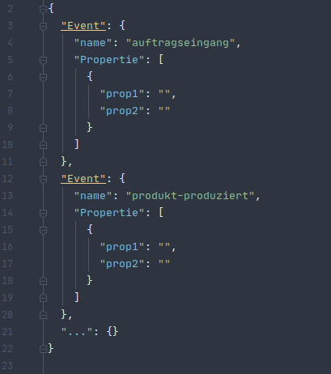
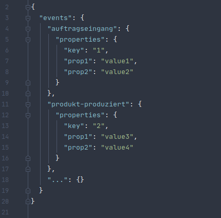
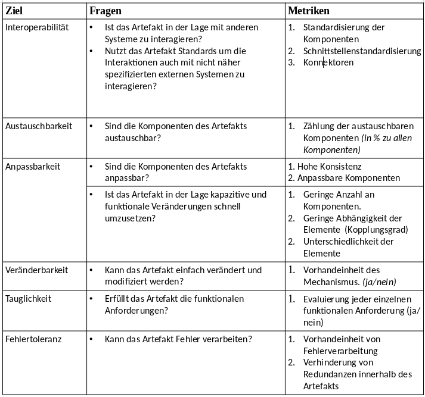
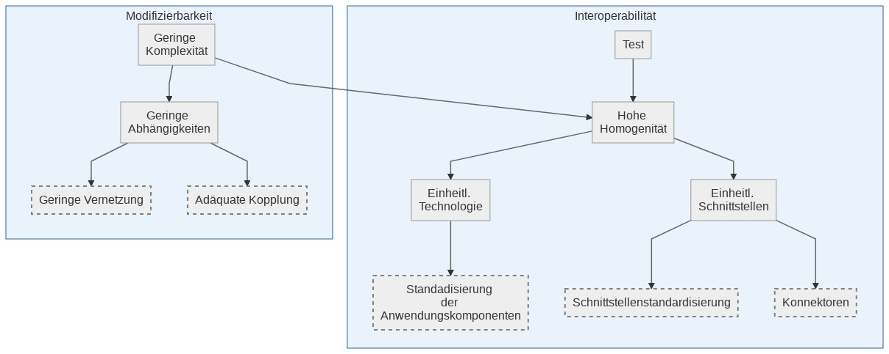

pref: [[3 Theoretische Grundlagen]]
[[1#Problem Flexibilität und Agilität könnte duirch EDA gelöst werden werden sie aber nicht]]
[[1 🚧 Projects/🎓 Bachelorarbeit/Literatur/Bruns, Dunkel - Event-Driven Architecture.md]]
[[1#Kein CEP im BPM Umfeld]]
[[1#Gründe für die fehlende Verbreitung von EDA]]
[[4 🗄️ Archive/🎓 Bachelorarbeit 1/Literatur/Bruns, Dunkel - Event-Driven Architecture]]

# Problemidentifizierung und Motivaton + Lösungsziele definieren
Zunächst wird das Problem, welches diese Arbeit behandelt wird identifiziert sowie die daraus resultierende Motivation näher eläutert. Daraus ergeben sich Kandiaten für die Design Principles (DP) (vgl. 3. Forschungsmethode) welche später genutzt werden um wissen über das Artefakt zu erfassen. 

Für eine einheitliche Definition der DP wird der ISO Standard 1926 verwendet.

## Problemidentifizierunng
Konventionelle betriebliche IT-Systeme bieten häufig nicht die erforderliche Flexibilität, um die fachliche Agilität abzubilden. Erschwerend kommt hinzu, dass die internen und externen Anforderung an Agilität stetig wachsen, unter anderem durch erweitere technische Möglichkeiten oder verändertes Kundenverhalten [@brunsEventDrivenArchitecture2010, p.3] [@averyJourneyEventDriven2019]. Vor dem Hintergrund der Digitalisierung und den sich daraus resultiertende Veränderung von Unternehmenprozessen stellen sich besondere Herausforderung an die Flexibilität von Unternehmen (Quelle). 

> **DP2: Anpassbarkeit** Ist das Artefakt in der Lage sich an Veränderungen im Umfeld anzupassen? 

Häufig sind starre Implementierungen von Geschäftsprozessen das Problem. Da tratdionionell de Fokus auf Zuständen und nocht auf Ereignissen leigt, sind Veränderungen dieser Prozesse mit großen Aufwand und Risiko Verbunden (Klotz). Bei dieser Sichtweise sind Daten und Prozesseschritte eng miteineander gekoppelt, man spricht auch von monolithischen Prozessdesign. 

> **DP3: Veränderbarkeit** Das Artefakt kann verändert und modifiziert werden.

> **DP1: Austauschbarkeit** Die Komponenten des Artwefakts sind austauschbar.

Lösungsansätze bieten Event-Driven Architecture (EDA), als Architekturstil und Complex Event Processing (CEP) als Softwaretechnologie. Sie repräsentieren einen neuen Stil von betrieblicher Softwarearchitektur, bei dem Ereignisse in das Zentrum der Softwarearchitektur rücken. Die resultierenden ereignisgesteuerten Anwendungssysteme ermöglichen eine realitätsnahe Abbildung der ereignisgesteuerten Geschäftsprozesses eines Unternehmens [@averyJourneyEventDriven2019, p. 4-5].

Ereignisgetrieben Architekturen haben sich in den letzen Jahren großer Beliebtheit erfreut. Dieser Architekturstil fokussiert auf die Ereignisse, die Veränderungen der vorhandenen Daten bewirken (anstelle der Zustände). Auf diese Weise lassen sich sehr große und vor allem skalierbare Integrationen erstellen, zum Beispiel auf Basis des “Publish-and-Subscribe”-Architekturkonzepts (Klotz).

##### Teilbereich BPM: Kein CEP im BPM Umfeld
*Noch auf Grundlagenteil: Anwenudng EDA vezhiehen*

EDA und insbesondere Event-Driven Service-Oriented Architecture (ED-SOA) erfahren in den letzten Jahren wachsende Aufmerksamkeit in verschiedensten Bereichen [@hamzahEXPLORATORYSTUDYINVESTIGATING2020, p.273-304] [@shaheenResearchSOAIT2019, p.149-154]. Des Weiteren bietet zunehmende Verbreitung von CEP zahlreiche neue Möglichkeiten im Business Process Management (BPM) [@lundbergLeverageComplexEvent2006, p.55-65].

Trotz der Verbeitung von ereignisgetrieben Architekturen allgemein ist zu erkennen, dass Anwendungen im ber des Geschäfprozessmanagement eher selten anzutreffen sind (Klotz).

Dies scheint verwunderlich, denn gerade diese mangelnde Flexibilität und Agilität könnte durch den Einsatz von CEP gelöst werden. Grund für die Etablierung von rigider und unflexibler Software ist die sukzessive flächendeckende Einführung solcher Systeme seit Anfang der 90er Jahre [@bungardEinfuehrungUnternehmensweiterStandardSoftwarePakete2005, p.14-21]. In der Vergangenheit wurden feste Unternehmensprozesse in Software „gepresst“ [@bayerAnwenderBrauchenMehr2016]. Um sich von diesen technischen Schulden zu lösen ist die Modernisierung von konventionellen betrieblichen Systemen zu SOA basierten Systemen zu einem Mainstream-Trend geworden [@abdellatifStatePracticeService2018, 643-650]

Alle Aktivitäten besitzen ein ausösendes Ereignis und können selbst wiederum eine Reihe von Ereignissen auslösen. Auf diese Weise können Prozesse sher einfach und risikoarm erweitert und in einer verteilten Umgebung bearbeitet werden. (Klotz) 

Ziel dieser Arbeit ist es daher, dem ursprünglichen Konzept der Ereignisgestuerten Prozesskette n(EPK) auf der Basis einer modernen Architektur wieder neues Leben einzuhauchen. Hierfür soll in verschienden Stufen ein Protoyp konzipiert und implementert werden, welche demonstiert, dass Geschäftsprozesse auf der Basis einer leisungsfähigen ereignisgetrieben Plattform wie Apache Kafka robust und sicher implementiert und orchesriert werden können (Klotz).

**DP4: Tauglichkeit** Erfüllt das Artefkat adequat alle funktionalen Anfoderungen? 

##### Fehlerhafte Ereignisse erzeugen hohe Kosten
Bei der Anwendung von ereignisgesteuerten Pub-Sub Systemen kommt es nicht selnten vor, dass Millionen Ereignisse pro Sekunde verarbeitet werden. Sollte ein Fehler während der Laufzeit passieren, wird dieser oft zu spät entdeckt und es wurden bereits viele falsch Ereignisse verarbitet. Dies kann Immenze kosten verursachen. Deshalb soll eine Architektur definiert werden, welche  weiterhin auf dem *Publish-Subscribe-Pattern* basiert, allerdings zur Laufzeit Ereignisse prüft und validiert umd solche Fehler zu vermeiden.
Die Anwendung soll sich auf die Implementierung von Geschäfprozessen in eine IT-Infrastruktur ermöglichen.

> **DP5: Fehlertoleranz** Ist das Artefakt in der Lage ein ein Level an Performanz zu halten auch wenn Fehler oder Verstöße gegen Regeln vorliegen? 

## (Gründe für die fehlende Verbreitung von EDA)
Die Gründe für die fehlende Verbreitung sind wenig erforscht, Bruns und Dunkel (2010) nennen mehre Gründe, von denen die zwei trotz des Alters auch heute noch beobachtbar sind. Der erste möglichen Grund  sind unvollständige sowie fehlende Standards. Dazu gehören vor allem fehlende technische Standards für wichtige EDA-Komponenten wie eine Event Processing Language (EPL) zur Beschreibung von Ereignis -typen und -regeln. Als weiterer Grund wird die Abwesenheit einer etablierten Entwicklungsmethodik genannt. Es existieren nur wenige ausgereifte Methodiken für die Entwicklung von ereignisgesteuerten Anwendungssystemen. Insbesondere Richtlinien, Entwurfsmuster, Best-Practise-Beispiele, wiederverwendbare Komponenten oder Vorgehensmodelle für EDA existieren oftmals nur in rudimentärer Form [@brunsEventDrivenArchitecture2010, p234-235]. 

> **DP4: Interoperabilität** Das Artefakt ist in der Lage mit anderen System zu inteagieren und nutzt gänige Standards.

Darüber hinaus ist die Qualität der angewendeten Systeme von Bedeutung. Unternehmen mit ereignisgesteuerten Architekturen verarbeiten Millionen von Ereignissen pro Sekunde [@churchwardExtremeAgilityTry2008] hier kann bereits ein kleiner Fehler in der Architektur großen Schaden anrichten.

## Herausforderungen im Umgang mit Ereignissen 
Die Menge an Ereignissen steig kontinuierlich an. Folgende Faktoren tragen im wesentlichen dazu bei, dass Unternehmen mit einem steig wachsenen Strom von Ereignissen umgehen müssen:  [@brunsEventDrivenArchitecture2009, p.29-30]

1. **Fachliche Komplexität**
   Geschäftsprozesse innerhalb eines Unternehmens vernetzen heutzutage unterschiedliche Abteilungen, Standorte und Fertigungstätten im In- und Ausland. Eine fortschreitende Arbeitsteilung zwischen Unternehmen führt zu einer engen, unternehmensübergreifenden Kopplung der Prozesse von Produzenten und Zulieferen entlang der Fertigungskette. 
2. **Technische Komplexität**
   Die meisten größeren Unternehmen besitzen eine komplexte und heterogene IT-Infrastruktur, welche historisch gewachsen ist. Es werden eine Vielzahl an Programmiersprachen, Technologien, Datenformaten und Schnittstellen verwendet.
3. **Kommunikation mit der physikalischen Umwelt**
   Sensorennetzwerke übermitteln Messdaten aus der physikalischen Welt und stellen hierdurch eine Verbindung zwischen den Unternehmenswendungen und der Außenwelt dar. 
4. **Datenmenge**	 
   Unternehmen müssen die zunehmende Anzahl an ereignissen systematisch identifizen und zeit- sowie ortsabhänig bereitstellen. Eine Herausvorderungen ist es dabei die anwachsende Menge an Ereignisedaten in die laufenden operativen Geschäftsprozesse zu integrieren. 
   
## Begründung für nicht gewählte Desing Principles (ISO)
*TODO*

# 2 Konzeption und Entwicklung 
## Beschreibung des Prototyps
Durch den Validator erreicht die Architektur eine Struktur welche mit der Mediator Topolgie vergleichbar ist. Der entscheidente Vorteil dieses Architekturansatzes ist, dass Fehler welche zur Laufzeit direkt erkannt und somit nicht wiederholt werden können. Bei der Anwendung von Publish-Subscribe Systemen im Unternehmenskontext werden nicht selten Millionen von Ereignissen in der Sekunde verarbeitet. Einfache Fehler können sich somit in kurzer Zeit oft wiederholen. Durch diese Architekturprinzup werden Ereignisse zur Laufzeit geprüft und validiert und die Wiederholdung von Fehler wird somit ausgeschlossen  

Im folgenden wird eine ereignisgesteurte Architektur entwickelt, welche anschließend prototypisch implementiert werden soll. 

Für die Entwicklung des Konzept wurde verschiedene Ansätze gewählt welche von Bruhns und Dunkel (2010) sowie Vogel (2009) näher ausgeführt werden. 

**Komponenten-Orientierung:** Komponente sind wiederverwendbar und in sich geschlossene Bausteiner einer Architektur. Komponentenorientierung etnstand aus der Problematik, dass Objekte in der objektorientierten Programmierung zar das Modularitätsprinzip umsetzten, aber als wiederverwendbar Einheiten oft zu klein sind [@vogelSoftwareArchitekturGrundlagenKonzepte2009, p.161-162]. 

> Eine Komponente ist eine Kompositionseinheit mit vertraglich spezifizierten Schnittstellen, die nur explizite Abhängigkeiten zu ihrem Kontext hat. Eine Software-Komponente kann unabhängig einge-setzt werden und sie kann durch Dritte komponiert werden. 

**Meta-Architekturen und Reflection:** Durch Meta-Programmierung erreichen Software-Systeme durch eine zusätzliche Abstratkionsebene mehr Flexibilität und Kontrollle. In der Regel wird zwischen dem Programm als ausführbare Answeisungen und den Daten, mit dem das Programm arbeitet, unterschieden. 
In der Regeln werden während der Laufzeit nur die Daten geänderund und nicht das Programm selbst. Das Paradigma der Meta-Programmierung (auch Reflexion oder Introspektion genannt) macht dies allerdings möglich und erlaubt dem Programm den Zugriff auf sich selbst. 

Damit hat das Programm zur Laufzeit informationen über Typinformationen, KLassen, Variablen und Methoden sowie die Vererbungshiearchie. Mit Reflexion ist es möglich, dynamisch Methoden aufzurufen, Klassen zu instanzieieren. [@vogelSoftwareArchitekturGrundlagenKonzepte2009, p.164]. 

Folgende funktionale Anfoderungen an das Artefakt wurden anhand der Problemdefinition sowie anhand Übelegungen zur Architektur definiert.
Sie werden in natürlicher Sprache nach den Regeln von Rupp et al. (2009) formuliert: [@ruppRequirementsEngineeringUndManagement2001a, p.228 ff]

**A1 Beschreibungssprache:** Zur Setup-Phase muss das System dem Anwender die Möglichkeit bieten, ereignisgesteuerte Geschäftsprozesse mit einer Beschreibungsssprache zu modellieren.

**A2 Syntaxprüfung:** Zur Setup-Phase muss das System Syntaxfehler der Beschreibungssprache erkennen und dem Anwender zurück melden.

**A3 Erstellung von Kafka Komponenten:** Zur Laufzeit muss das System anhand Bescheibungssprache die Kafka Komponenten Producer, Consumer, Topics und Events erzeugen.

**A4 Validierung:** Zur Laufzeit muss das Sytem eintreffende Ereignisse validieren und diese entsprechend in outbound-Topics oder error-Topics speichern.

**A5 Änderungen zur Laufzeit:** Zur Laufzeit soll das System in der Lage sein Änderungen der Beschreibungssprache zu verarbeiten und die Kafka Komponenten aus Anfoderungen A2 anzupassen.

## Modul 1: Notation
Ziel des Moduls ist die Defnition einer Domain Specific Langage (DSL) in Form einer Beschreibungssprache für Geschäftsprozesse. Ziel der Beschreibungsssprache ist es ereignisgesteuerte Prozessabläufte zu modellieren. Diese Beschreibungssprache wird ähnlich zu bereits bekannten Modellierungsprache wie die "Ereignisgesteuerte Prozesskette" (EPK) sein. EPK zeichnen sich dadruch aus, dass auf ein Ereignis immer eine Funktion (Prozess) folgt. 

Die Modellierung soll zwei Zwecken dienen: Zum einen sollen auf Basis der Konfiguratin mögliche viele Apache-Kafka Artefakte generiert werden und zum anderen sollen die soll die Abfolge der Prozessschritte zur Laufzeit kontrolliert werden können um die Korrektheit eintreffender Ereignisse zu überprüfen. 
Hierbei ist eine grafische Modellierung, wie es bei EPK oder BPMN üblich ist nicht sinnvoll, deshalb wird eine Beschreibungspsrache in textform genutzt werden. Bei einer potentiellen späteren Weiterenwicklung ist die Entwicklung einer grafischen Front-Ends denkbar.  

Im Rahmen dieses Prototypes stehen bei der Beschreibungssprache vor allem prakmatische Aspekte im Vordergrund und folgt daher einen simplen Aufbau. Allerdings soll die Notation so konzipiert sein, dass komplexere Elemente später noch hinzugefügt werden können. Denkbar sind hier unter anderem logischer Operatoren mit denen z. B. eine parallelisierte Darstellung von Geschäftsprozessen möglich wäre.

Die DSL ist für nicht technische Nutzer gedacht welche bereits Kentnisse mit der Syntax von JSON besitztn. Für eine vereinfachte Benutzung ist auch die Implementierung einer grafischen Benutzeroberfläche als Front-end, mit welcher die DSL erzeugt werden könnte. 

### Implementation Modul 1
##### JSON Schema
Für die Syntax der Beschreibungssprache wurde die JavaScript Object Notation (JSON) gewählt. Dies ist ein kompaktes, menschenlesbares Datenformat welches verbreitet in der Client-Server Kommunikation ist. 

JSON besitzt standardmäßig nur wenige Syntax- und Strukturregeln. Deshalb es von Nöte zusätzliche Regeln für den Aufbau des JSON festzulegen. 
Deshalb wurde sich entschiedenen ein JSON-Schema, welches einen festgeschriebenen Standard für den Aufbau des JSON Doluments darstellt, zu nutzen. 
Die Nutzung eines JSON-Schemas wurde gewählt, da die Confluent-Platform mit der *Confluent Schema Registry* ein RESTful interface bereitstellt (mehr in Modul2). 

Dies ermöglicht die Verarbeitung der Notation druch weitere Programme sowie die Validierung der Syntax. 

Als beispielhafter prozess könnter folgender verwendet werden:

Um ein das Architekturprinzup "Seperation of Concerns" zu gewährleisten wird das schema in zwei Teile aufgeteilt:
- **configschema:** Gibt nur den Namen der events sowie die Namen der Eigenschaften jedes Events.
- **dataschema:** Hält die Daten von Events welche am Anfang der Laufzeit erstellt werden sollen. Später können natürlich weitere Events erstellt werden. 

Diese ist auch aus technischer Sicht notwendig, da die Erstellung der Ereignisse und die Überführung der Daten in Objekte in zwei unterschiedlichen Schritten stattfinden. Da das configschema sowohl ds JSON-Schema standard als auch den Eigenschaften des Avro-Schemas ensprechen muss würde eine Zusammenlegung der Schemas in einen hohen Aufwand münden. 

##### JSONSchema

 
#### JSON zu Avro Schema 
Mit der Beschreibungssprache lassen sich noch keine Kafka Komponenten generieren. Hierfür muss ein weiteres Datenschema erzeugt werden, welches in Kafka Architekturen genutzt wird. In Kafka wird hierfür in der Regel die Confluent Schema Registry genutzt. Dise stell ein RESTful Interface für das speichern abrufen sogenannter *Avro JSONSchemas* zur verfügung. 

Die zentrale Funktion der Confulent Schema Registry ist die *Schema-Evolution*. Sollte ein bereits vorhandenes Schmema verändert werden bietet Condluent eine automatische Versionierung an. Damit wird eine Anpassbarkeit des zugrundeleigenden Speichermechanismus von Apache Kafka ermöglicht.

Im Prototyp ist es damit möglich Porzessänderungen während der Laufzeit vorzunehmen. Sollte also neue Prozessschritte hinzukommen, wegfallen oder sich ändern, kann die DSL geändert werden ohne das die bisherige Architektur komplett neu erstellt werden muss. Ohne die Nutzung die Schema-Evolution müsse bei jeder Änderung am Schema die Architektur neugestartet werden. 

Um aus der bisherigen Beschreibungssprache ein *Avro JSON Schema* zu serialisieren wird die Scala Bibiliothek *avro4s*  verwendet. Das enstprechende Modul erhält als Input das JSON-Schema transformiert dieses in ein Avro-Schema. 

## Modul 2: Generator 
- Parse Data Schema -> Avro Objects from Avro Classes (Event, Prop) -> Producing

Ziel dieses Moduls ist die Implementierung Generators, welcher anhand der zuvor beschriebenen Beschreibungssprache als Input ensprechende Apache Kafka Komponenten erzeugt. Hierzu gehören Producer, Consumer, Topics sowie die definierten Ereignisse und deren Eigenschaften. 

Hierbei wird wieder keine grafische Benutzeroberfläche implementiert, das Programm ist ausschließlich über das Terminal oder die entsprechenen Entwicklerwerkzeuge steuerbar. 

### Implementation Modul 2
Die Producer und Konsumer in Kafka sind in Java geschrieben. Um das Avro Schema nutzbar zu machen muss dieses erst Sinnvoll in Java-Klassen umgewandelt werden. Avro hat die Fähigkeit Java Code aus einem Avro Schema zu erstellen. Mithilfe des Build Management Tools Apache Maven ist die sehr einfach in jeder IDE möglich. 

Im oben aufgeührten Beispiel werden die Java Klassen "Event" und "Propertie" erstellt. Welche entsprechend Events und deren Eigenschaften repräsentieren. 

Eine Herausforderung hierbei ist, dass die generierten Klassen sich je nach Prozess deutlich unterscheiden. Die Anzale der Ereignisse sowie die Anzahl und Datentypen deren Eigenschaften ändern sich mit jeder neuen Prozessbeschreibung. Beispielsweise könnte das Ereignis "Auftragseingang" die Eigenschaften Auftragsnummer, Name und Datum haben, während das Eregnis "Rechnung beglichen" die Eigenschaften zusätlich die Eigenschaften "Rechnungsnummer und "Betrag" halten könnte.
Diese variabliltät der "Event" sowie "Propertie" Klassen macht die Verarbeitung dieser mit einem statischen Java-Programm unmöglich. 

Deshalb wird hier das Prammierprinzip Introspektion (engl. reflection) verwendet. Dieses bedeutet dass das Progbramm zur Laufzeit seine eigene Struktur kennt und modifizieren kann. In diesem Fall passt sich der Programmcode die Überführung der Daten in die Java-Objekte an die generieren Klassen zur Laufzeit an. Dies hat den Vorteil das der Programmcode nicht manuell angepasst werden muss und dier somit flexibel auf sich verärnde Klassenstrukturen reagieren kann.  
Um dies Umzusetzen gibt es die Klassen *"Reflection"* und *"AvroAutoCoder"* welche die Funktion übernehmen. 

Anschließend übernimmt der *JsonObjectMapper* das Mapping der Daten im Datenschema auf Java-Objekte indem das Datenschema geparsed wird. Diese Objekte werden im folgenden *Avro-Objekte* genannt. 
Mit den generierten Avro-Objekten kann ein Avro-Kafka-Producer umgehen und diese in die entsprechenden Topics produzieren. Hierfür werden zur Laufzeit für jedes Ereigniss  drei Topics erstellt. Zum einen wird inbound-Topic erstellt, in welchem alle bisher noch nicht validierten Ereignisse gespeichert werden. Zum anderen werden für des Ereignis ein outbound- sowie error-Topic erstellt in welchem später korrekt oder inkorrekt validierte Ereignisinstanzen gespeichert werden. 

Die Erstellung der Topics übernimmt der *TopicHandler*, die namen der topics werden der Konfiguration entnommen. Die Namen der Topics werden aus der Konfiguration entnommen und jeweils durch ein "-in", "-out", "-err" weitert. Damit ist es weiteren Komponenten, wie dem Validator, möglich diese Topics nur mit der Kenntnis der Konfiguration zu verwenden. 

## Modul 3: Validator
Im Validator steckt die Kernfunktionalität der Architektur. Ziel des Validators ist zur Laufzeit alle eintreffenden Ereignisse nach festgelegten Kriterien zu validieren. Dies könnte z.B. sein dass ein Ereginiss einer Prozessinstanz zugeordnet werden kann oder das die Properties eines Ereginisses bestimmtem Kriteren entsprechen. Abhängig von dem Ausgang der Validation werden die Ereginisse welche sich anfang in einem der Inobound-Topics befinden in eines der beiden anderen Topics gespeichert werden.

Zur Laufzeit können somit fehlerhafte Ereignisse "herausgefiltert" werden. Damit wird die weitere Verarbeitung von Fehlerhaften Ereignissen verhindert. 

Durch den Validator erreicht die Architektur eine Struktur welche mit der Mediator Topologie vergleichbar ist. Der entscheidente Vorteil dieses Architekturansatzes ist, dass Fehler welche zur Laufzeit direkt erkannt und somit nicht wiederholt werden können. Bei der Anwendung von Publish-Subscribe Systemen im Unternehmenskontext werden nicht selten Millionen von Ereignissen in der Sekunde verarbeitet. Einfache Fehler können sich somit in kurzer Zeit oft wiederholen. Durch diese Architekturprinzup werden Ereignisse zur Laufzeit geprüft und validiert und die wiederholdung von Fehler nwird somit ausgeschlossen  

### Implementation
Ein Kafka-Avro-Consumer abboniert alle zuvor erstellen Topics und empfängt alle Ereignisse aus. Anschließend werden die Ereignisse einer logischen Prüfung unterzogen und abhänging vom Ausgang der tests in das outbound- oder error-Topic gespeichert. 
Momentan werden im Prototyp die Konfiguraton als auch die Logik der Prozessintanzen überprüft. Die Konfiguration wird bereits während des Setups des Prototypes geprüft. Sollte sich ein Fehler im JSON-Schema oder Datenschema befinden wird eine Entsprechende Ausnahme geworfen. Die Prozessinstanzen werden während der Laufzeit für jedes konsumierte Event geprüft. Jedes Event erhält in der Konfiguraton eine eindeutige ID welche die Position im Prozess festlegt. 

Zur Laufzeit verfoglt der Validator alle eintreffenden Ereignisse und versucht diese einer bestehenden Prozessinstanz zuzuordnen. Sollte es sich um ein Ereignis mit der id 1 handeln wird eine neue Prozessinstanz erstellt. Alle bisher erstellen Prozessinsanzen werden in einer Mapping-Tabelle den IDs der Ereignisse zugeordnet. Somit ist es dem Validator möglich eintreffende Ereignisse zu überprüfen.  

# 4 Demonstation
## Konfiguration
Zuerst muss das Artefakt konfiguriert werden. Dies involiert das JSONSchema als auch das Datenschema. Die Ereignisse (Events) des ereignisgesteuerten Prozesses sowie die Attribute (Properties) werden definiert. Im Datenschema können Daten für jedes definierte Event festgelegt werden. 

*Screenshots Schemas*

## Laufzeit
Um die Ereginisse für Kafka nutzbar zu machen müssen diese in meheren Schritten in Java-Objekte überführt werden. Dies geschieht wie zuvor beschrieben mittels einer Serialisierung des JSON-Schemas zu einem Avro-Schema und anschließend werden aus diesem Schema Java-Klassen mittels Maven erstellt. Aus diesen Klassen werden zur Laufzeit Objekte generiert welche mit den Daten des Datenschemas befüllt werden. 

Für jedes Ereginis werden die entsprechenden Topics vom *TopicHandler* erstellt. 

*ScreenShot Topics*

Alle eingehenden Ereignisse werden von einem Kafka-Producer in die entsprechenen Inbound-Topics produziert. Die Ereignisse welche im Datenschema während der Konfiguration festgelegt wruden werden als erstres produziert. 

Jedes eingehende Ereignis wird nachdem es in ein Inbound-Topic produziert wude vom Validator konsumiert und validiert. Sollte die Validierung positiv ausfallen wird das Ereigniss in das entspechende Outbound-Topic gespeichert, ansonsten wird es ein ein Error-Topic gespeichert. 

## Verarbeitung eines Fehlers während des Konfiguration
Sollte sich nicht an die korrekte Syntax des JSON-Schemas gehalten werden müssen ebenfalls Fehler erzeugt werden. 
Durch die Nutzung von JSON-Schema und deren Libraries bereits eine vollständige Valdierug des Schemas gegeben. Der Serialisierung des Avro-Schemas wird eine Validierung zugeführt und eines ensprechende Ausnahme geworden sollte sich ein Fehler im Schema befinden. 

## Verarbeitung eines Fehlers zur Laufzeit
Während der Laufzeit ist es natürlich möglich weitere Ereignisses zu erzeugen. Im folgenden wird demonstriert was bei der während der Validierung eines Fehlerhaften Ereignisses passiert. 

Im folgenden wird mittels eines weiteren Producers ein Ereignis erzeugt, welches keiner bestehenden Prozessinstanz zugeordnet werden kann und somit als fehlerhaft gewertet wird. 

# 5 Evaluation
## Übersicht

In der folgenden Evaluation wird die Architektur anhand Ihrer Module sowie deren Bestandteile gemessen. Da es sich hierbei um größtenteils generische Begriffe handelt bedarf es einer Definition im Kontext des Artefakts.
Die Anwendungs als ganzes wird *Artefakt* genannt. Das Artefakt besteht aus drei *Modulen* Notation, Generator und Validor. Jedes dieser Module besteht widerum aus *Komponenten* welcher wiederum aus *Objekten* im Programmierkontext bestehen.  
Als Komponenten werden hier einzelne Klassen oder Klassen welche eine Funktionalität erfüllen abgegrenzt. 

*Übersicht der Komponenten und Module*

{width=80%}

## Tauglichkeit
Um die Tauglichkeit des Artefakts zu bestimmen muss überprüft werden, ob das Artefakt die funktionalen Anforderungen erfüllt und ob die Umsetzung des Anfoderungen angemessen ist. 

Die Metriken sind hierbei:
1. **Vorhandenheit:** Überprüfung jeder funktionalen Anforderungen: Ist diese vorhanden? 
2. **Angemessenheit:** Entspricht die Umsetzung der Spezifikation oder besteht hier noch nachbesserungsbedarf? 

Im folgenden werden alle Anfoderungen an das Artefakt einzeln evaluiert. Hierbei wird auf die Angemessenheit der Umsetzung sowie Verbesserungsmöglichkeiten eingengangen. 
	
##### A1 Beschreibungssprache:
Der Anwender kann zur Setup-Phase ereignisgesteuerte Geschäftsprozesse anhand einer Beschreibungsprache im JSON-Schema Format modellieren sowie initiale Daten in einem weiteren Schema (Datenschema) mitgeben. 

Es sind einfache, lineare Prozesse mit einer begrenzten typisierung möglich. Durch die Nutzung von JSON Schema sowie eine offene implementierung ist eine erweiterung des Schemas für komplexere Geschäftsprozesse möglich. 
Denkbar ist die implementierung weiterer Datentypen oder die Einführung von logischen Elementen mittels Operatirn wie "OR" oder "AND". Diese Logik muss alerdings auch im Rest der Anwendungs realisiert werden. 

##### A2  Syntaxprüfung: 
Wenn der Anwender mit einem Fehler die Syntaxregeln von JSON-Schema verletzt wird bei der Umwandlung des Schemas in ein Avro-Schema eine Ausnahme geworfen. Diese Ausnahmen stammen von der *avro4s* Bibliothek und werden nicht verändert. 
Für einen nicht-technischen Nutzer sind diese Ausnahmen schwer lesbar, für die Benutzbarkeit müssen hieraus noch lesbare Fehler generiert werden. Dies könnte mit einem passenden Front-End, wie einem grafischen Editor, erreicht werden. 

Fachliche Fehler im Prozess werden weder in der Setup-Phase noch zur Laufzeit überprüft. 

##### A3 Erstellung von Kafka Komponenten:
Zur Laufzeit erstelle das Artefakt alle spezifizierten Komponenten. Im Umfang der Protoyps wird zur Laufzeit ein Producer sowie ein Consumer erstellt. Für jedes Ereignis werden drei Topics vom *Topic Handler* erstellt. 
Die Anzahl der Ereignisse und Topics ist damit anhand der Konfiguration variierbar. Weitere Producer und Consumer könnten Problemlos hinzugefügt werden. 

Somit die die Anfoderung A3 erfüllt.

##### A4 Validierung: 
Zur Laufzeit ist das Artefakt in der Lage eintreffende Ereignisse zu validieren. Momentan findet eine logische Validierung zur Sicherstellung der Konsistenz einzelner Prozessinstanzen statt. Wenn in der Konfiguration eine Verkettung aus "Ereignis_A" und "Ereignis_B" vorsieht zur Laufzeit aber ein "Ereignis_B" eintritt ohne dass im Zeitraum zuvor das andere Ereignis verarbeitet wurde wird ein Laufzeitfehler erzeugt. 

Eine erweiterde Validierung ist ebenfall denkbar. Beispielsweise könnten die Werter innerhalb der Prozesse geprüft werden oder "leere" Ereignisse gefiltert werden. Der Protoyp könnte ohne weiteres mit diesen Validierungen erweitert werden. 

Die Anfoderungen A4 ist erfüllt. 

##### A5 Änderungen zur Laufzeit
Bei einer Änderung der Konfiguration gibt es im Prototyp gibt es im Prozess eine Stelle welche einen manuellen Eingriff benötigen. Das JSON-Schema muss mit mittels eines weiteren Projekts in ein Avro-Schema umgewandelt. Aus diesem Avro-Schema müssen ebenfalls manuell mit Maven die Avro-Klassen generiert werden. Dieser Schritt wäre mit zusätzlichem Entwicklungsaufwand auch automatisierbar.

Die restlichen Module des Artefakts wurden so konzipiert, dass Sie Veränderungen der Konfiguration automatisch umsetzen können. Insbesondere der Code des Generators muss sich an die Veränderungen der Avro-Klassen anpassen. Damit der Code nicht manuell angepasst werden muss wird hier Reflection genutzt um einen den relevanten Teils des Codes zur Laufzeit automatisch zu generieren (vgl. Konzeption und Entwicklung)

### Zusammenfassung
Damit sind folgende Anforderungen erfüllt: 

|Anfoderung    |Vorhandenheit|Angemessenheit
|---    	    |:---:|:---:|
|A1 Beschreibungssprache             | x |   
|A2 Syntaxprüfung                    | x |   
|A3 Erstellung von Kafka Komponenten | x |   
|A4 Validierung                      | x |   
|A5 Änderungen zur Laufzeit          |   |   

Damit sind 80% der Anfoderungen erfüllt und die Architektur erfüllt damit das Design Principle "Tauglichkeit".

## Fehlertoleranz 
Um fehlertolerant zu sein, muss überprüft werden, ob das Artefakt auch in der Lage ist ein definiertes Leven an Performanz zu halten auch wenn Fehler oder Verstöße gegen Regen vorleigen.

Metriken sind hierbei:
1. **Fehlerbehandlung:** Evaluation ob Mechanismen oder Softwarebestandteile vorhanden sind, welche Fehler verarbeiten können. Beispiele hierfür ist die Behandlung von Ausnahmen (*Exceptions*) oder das Verhindern von Redundanzen.

Wenn sich ein Fehler in der Konfiguration, dem Schema, des Artefakts befindet wird bei der Serialisierung des Avro-Schmeas eine Ausnahme geworfen. Mit einem Fehler in der Konfiguration wäre die Architektur nicht lauffähig, deshalb muss der Fehler vom Nutzer behoben werden bevor das Programm weiter ausgeführt werden kann. 

Der Fehler wird momentan in einer Ausnahme (Exception) ausgegeben wie es im Softwareentwicklungsumfeld üblich ist. Für einen nicht-technischen Nutzer wersind  diese allerdings nur schwer verständlich sein. Für eine höhere Usability müssen hier verständlichere Fehler erzeugt werden. 

Treten fehlerhafte Ereignisse zu Laufzeit auf, meist fehler hafte Prozessinstanzen, wird dies vom Validiator erkannt und in entsprechende Error-Topics gespeichert. 
Treten während der Laufzeit fehlerhafte Ereignisse auf, wird die vom Validator erkannt und diese werden im entsprechenden Error-Topic gespeichert. Damit wird der ensprechende Prozess mit einem Laufzeitfehler aufgehalten bis eine Klärung des Fehlers erfolgt. 
Fehlerhafte Ereignisse beinflussen somit nicht die Performanz des Systems.  

## Interoperabilität 
Damit das Design Principle erfüllt ist müssen die Module und Komponenten des Artefekts gelcihe Strukturmerkmaleverwenden. Des Weiteren muss das System in der Lage sein mit anderen Systemem zu inteagieren. Im Ideafall wird dies durch die Verwendung von gängigen Standards erreicht. 

Um das Artefakt auf das Design Principle "Interoperabilität" erreich muss das Ziel der "hohen Homogenität" erfüllt werden. Dieses erfordert einheitliche systeme und Schnittstelle und setzt sich damit aus den Zielen "Einheitliche Technologie" und "Einheitliche Schnittstellen" zusammen. 

Aus der Zielhiearchie werden folgende Metriken abgeleitet: 

### Standardisierung der Anwendungskomponenten 
*Anwendungskomponenten müssen die gleichen Strukurmerkmale verwenden als auch so gut es geht die gleichen technoligien nutzen.*

Das Artefakt benutzt hauptsächlich Technologien um Umfeld der Conflunt Platform und damit Apache. Hierzu gehörten Apache Kafka und alle seine Komponenten, die Schema Registry. Das Software Development Kit (SDK) von Apache Kafka ist in Java implementiert. 
Die Schema Registry basiert auf JSONSchema. Somit basieren alle Komopnenten, außer der *JsonToAvroConverter* auf diesen Technologien. Dieser nutzt die Bibliothek *avro4s*, welche nicht Teil der Confluent-Platform ist und welche Scala anstatt Java nutzt. 

Somit ist das Kriterium weitgehend erfüllt. Für eine vollständige Erfüllung müsste die Funktionalität der *avro4s*-Bibliothek vollständig in Java implementiert werden. Eine Java-Bibliothek existiert hierfür nicht. 

- **Schnittstellenstandardisierung:** Der Informationsaustausch zwischen Komponenten, Modulen und kompletten Anwendungssystemen muss über standardisierte Schnittstellen stattfinden. 

Das Artefakt enhält keine anwendungsübergreifende Schnittstellen. Somit werden nur die Schnittstellen zwischen den Modulen betrachtet.  

Zwischen dem Modulen "Notation" und "Generator" wird über Daten im JSON-Schema Format kommuniziert. Das Datenformat selbst standardisiert (RFC 8259) und weit verbreitet. Die Umwandlung von einem *AvroSchema* zu *Java Klassen* ist aber ein Feature spezifisch für das Build-Mangement-Tool "Apache Maven". Somit entspricht die Schnittstelle keinem Standard sondern befindet sich im im Bereich der Apache-Technologien.

Die Schnittstelle zwischen den Modulen "Validator" und "Generator" ist durch die Nutzung von Apache Kafka standardisiert. Jeder Producer und Consumer, welcher sich an die spezifizierten Richtlinen von Kafka hält kann in der Anwendung mitwirken. 

### Konnektoren 
*Idenfifikation von Konnektoren welche mit externen System kommunizieren könnten.*

Die Integration weiterer Systeme ist über Apache Kafka möglich. Weitere Consumer könnten Ereignisse der Anwendungs weiter verarbeiten.

## Modifizierbarkeit
*Wie ist die Komplexität der Module und damit des  gesamten Systems einzuschätzen?*

**Fragen** 
- Kann das Artefakt einfach verändert und modifiziert werden, um zum Beispiel neue Funktionalitäten zu implementen?

### (Geringe Vernetzung)
Das erste Modul, die Notation, ist simple gehalten. Durch die Aufteilung in zwei Schemas ist die Komplexität eines einzelnen Schemas überschaubar. Was die Komplextität im ersten Modul deutlich erhöht ist die Implementierung des *JsonToAvroConverter* in einer weiteren Programmiersprache (Skala). 

Das Zweie Modul, der Generator ist von der grundlegenden Struktur ebenfalls simpel gehalten. Da hier durch den *AvroAutoCoder* zentrale Code-Bestandteil zur Laufzeit generiert werden entsteht hier auch Komplextität. Die genierten Code-Benstandteile unterscheiden sich bei jeder Ausführung, bei der auch das JSON-Schema verändert wird. Des Weiteren wird dadurch das Debuggung für den Entwickler erschwert. 

Komponenten wie der *TopicHandler* oder der *JsonObjectMapper* unterscheiden sich in ihere Komplextität nicht sonderlich von vergleichbaren implementationen. Der *JsonObjectMapper* nutzt hierbei gängige Bibliotheken für das verarbeiten von JSON Dokumenten. 

Alle Kafka Komponenten unterscheiden sich kaum von der Standarimplementation. Hier wurde nicht viel hinzugefügt. Da die Kafka-SDK auf einem hohen Abstaktionslevel ansetzt ist auch hier die Komplexität überschaubar. 

Insgesamt ergibt sich eine Mischung aus komplexen und unkomplexten Komponente. Deshalb ist das Design Principle nur teilweise erfüllt. 

### Hohe Homogenität
Das Design Principle "Modifizierbarkeit" teilt sich mit "Interoperabilität" das Unterzhiel "Hohe Homogenität". Einheitliche Systeme und Schnittstellen tragen ebenfalls dazu bei, dass das Artefakt leichter modifiziert werden kann. 

Die Ziele welche die Homogenieität des Artefakts wurden bereits evaluiert. Insgesamt ist das Artefakt homogen genug, so dass jede Komponente ohne großen Aufwand modifiziertbar ist. Hierauf wirkt sich auch positiv aus, dass der Umfang des Artefakts im Vergleich zu einer produktiven Anwenungs begrenzt ist. 

### Datenredundanzfreiheit
Innerhalb des Artefakts kann zwischen drei Datenbeständen unterschieden werden, welche an unterschiedlcihen Stellen verwaltet werden. 
Den ersten Datenbestand stellen die vom Nutzer erstellen Schemas (JSON-Schema, Datenschema) dar. Diese Schema werden im Modul "Notation" erstell und im Modul "Generator" verwaltet und verarbeitet. Hierbei entstehen keine Redundanzen. 
Die aus den Schemas erstellen Ereignis-Objekte können als eigener Datenbstand betrachtet werden. Diese Daten werden ausschließlich im Modul "Generator" vewaltet und verarbeitet, hier bestehen auch keine Redundanzen. 
Der Drite Datenbestand sind die Kafka-Ereginisse. Im Artefakt werden diese von einem Broker verwaltet, somit bestehen hier ebenfalls keine Redundanzen. Allerdings könnten bei einer späteren erweiterung des Artefakts durch weitere Producer, Consumer und Broker Datenredundanzen entstehen, dies sollte vermieden werden. 

Eine Datenredundanzfreiheit ist gewährleistet. 

## Austauschbarkeit
**Fragen(n)**
- Sind die Komponenten des Artefakts entkoppelt und damit austauschbar? 
![[zh_austauschbarkeit.png]]

### Hohe technische Modularität
Für eine hohe technische Modularität ist eine Entkopplung der Module Notwendung. Die Module sind weitestgehend entkoppelt. Das Modul Notation kommuniziert mit dem Generator Modul nur über die definierten Schemas. Daher ist die einzige Abhängigkeit hier die Strukturmerkmale der Schemas, diese Abhängigkeit liegt der Funktionsweise des Artefakts zugrunde und ist nicht verhinderbar. Sollten sich die Strukturmerkmale oder die Anzahl der Schemas verändern müsste die Komponente JsonObjectMapper entsprechend angepasst werden. Sollten die Veränderungen so weitreichend sein, dass die Regeln von JsonSchema nicht mehr eingehalten werden, müsste die JsonToAvro-Komponente ebenfalls angepasst werden.

Das Modul Generator kommuniziert mit dem Validator-Modul ausschließlich über Kafka-Komponenten. Mit einen Producer werden Events produziert und über einen Broker mit einem Consumer empfangen. Die Implementierung weicht hierbei nicht vom Standard in Apache Kafka ab. Publish-Subscribe-Architekturen wie Apache Kafka zeichnen sich durch eine Entkopplung der einzelnen Komponenten aus. Damit sind die einzelnen Kafka-Komponenten Events, Topics, Producer und Consumer komplett entkoppelt. Die einzelnen Kafka Komponenten können jederzeit und ausgetauscht werden.

Somit ist der Kopplungsgrad zwischen den Modulen Notation und Generator mittel. Der Kopplungsgrad zwischen den Modulen Generator und Validator ist gering.

Des weiteren ist bei einer hohen technischen Modularität notwendig, dass die Anwendung nach technischen Kriterien strukturiert wird (vgl. theoretische Grundlagen). Nach Engels et al. (2008) handelt es sich bei dem Modul “Notation” um eine Interaktionskomponente, welche der Interaktion mit Anwenden dient. Allerdings könnte es auch teilweise als Funktionskomponente bezeichnet werden da im JsonToAvroConverter Funktionalität implementiert ist. Hier besteht also eine unscharfe Definition.

Bei dem Modulen “Generator” handelt es sich um eine Prozesskomponente, welche der Abbildung und Steuerung fachlicher Geschäftsprozesse dient. Das Modul “Generator” ist eine Funktionskomponente, welche eine Funktionalität (die Validation) implementiert.

Somit lässt ist eine technische Modularität der Komponenten feststellbar, auch wenn diese teilweise unscharf bei einzelnen Komponenten existiert.

### Austauschbarkeit der Komponenten 
*Identifizierung und Zählung der Austauschbaren Komponenten.*

Im folgenden wird anhand einer Auflistung aller Komponenten des Artefakts bestimmt, welche der Komponenten austauschbar ist. Als Austauschbar gilt hierbei eine Komponenten, deren Austausch durch eine andere oder veränderte Komponenten die restliche Architektur nicht beinflussen würde. 

| Komponente | Austauschbar? | Beinflusse Komponenten |
|:-----------|:--------------|------------------------|
|JsonSchema + JsonToAvroConverter | Nein | JsonObjectMapper
|MavenClassGenerator | Ja | - 
|Event + Propertie| Ja | -
|Propertie | Ja | - 
|AutoCoder | Ja | - 
|DataSchema | Nein | JsonObjectMapper
|JsonObjectMapper | Nein | JsonSchema, DataSchema |  
|AvroProducer | Ja | - | 
|TopicHandler | Ja | - | 
|AvroConsumer | Ja | - | 
|Validator | Ja | - | 

Die Komponenten *JsonSchema*, *DateSchema* und *JsonObjectMapper* besitzen eine hohe Kopplung zueinander. Da der JsonObjectMapper die beiden Schemas verarbeitet müsste er bei einer Veränderung dieser ebenfalls angepasst werden. 

Damit sind 70% aller Komponenten austauschbar. Somit ist das Design Principle erfüllt. 

Durch eine modulare Struktur und die Vermeidung von Redudanzen innerhalb der Anwenudngslandschaft können bestehende Daten und Funktionen wieder verwendetet werden. Dies führt zu einer hohen funktionalen Agilität.
Wie bereits festgestellt ist die Autauschbarkeit und damit die Modularität des Artefakts gegeben. Des weiteren zeichnet befinden sich im Artefakt auch wenige Redundanzen. 

### Funktionale Redundanzfreiheit
Im Artefakt befinden sich keine funktionale Redundanzen. Dies ist vor allem dem Umfang des Artefakts geschulet. Alle implementierten Funktionen in der Regel nur an einer Stelle genutzt und nicht wieder verwendet. Bei einer erweiterung des Systems gilt es darauf zu achten vorhandene Methoden weiderzuverwenden anstatt die funktionalität erneut zu implementieren. 

Eine funktionale Redundanzgreiheit ist gewährleistet. 

### Adäquate Kopplung
Eine maximale Abhängigkeit leigt vor, wenn Komponenten paarweise miteinander verbunden sind. Eine minimale Abhänigkgiet liegt vor, wenn keine Verbindungen exisiteren.
Um das Ziel der "Geringen Abhängigkeit" zu erreichenm muss das Systeme eine geringe Vernetzung aufweisen und die vernetzten Systeme müssen adequat gekoppelt sein (vgl. theoreische Grundlagen). 

Das Artefakt ist fachlich in drei Module "Notation", "Generator" und "Validator" gegliedert. Eine adäquate Kopplung erfodert, dass die Module unterneinter mögliche wenig vernetzt sind (lose Kopplung), während sie intern stark wenere sind (hohe Kohäsion).

Das Modul "Notation" ist mit dem Modul "Generator" vernetzt durch die Komponenten "JsonToAvroConverter" und "MavenClassGenerator" (vgl. Komponentenübersicht). Das Modul "Generator" und das Modul "Validator" sind ein Mal durch das Producer, Broker, Consumer Konstrukt von Kafka vernetzt. 

Die Komponenten innheralb der Module gekoppelt, was durch die Verbindungen in dder Modulübersicht sowie das UML-Klassendiagramm dargestellt wird.

Die Komponenten sind Modulintern eng gekoppelt, während die einzelnen Module durch zwei Schnittstellen lose gekoppelt sind. 

## Anpassbarkeit 
**Fragen**
- Ist das **Artefakt** in der Lage kapazitative und funktionale Veränderungen der Umwelt schnell umzusetzen? 

### Adaptionsfähigkeit der Komponenten
*Evaluiaton des Artefakts und seinen Komponente auf die Fähigkeit sich anzupassen.*

Das Artefakt besitzt implementierte Funktionen, um sich an Veränderungen anzupassen. Die Kernfunktionalität des Artefakt ist es, es sich an verändertet Konfiguartionon, oder fachlich augedrück sich verändernde ereignischgesteuerere Prozesse anzupassen. Somit wurde diese Dynamik bei der Implementatoin beachet. 

Die Benutzten Werkzeugee und Bibliotheken besitzen bereits von Haus aus eine hohe Anpassbarkeit. Dies betriff die Schemas sowie den *JsonToAvroConverter*.
Dies Schemas werden vom User bearbeitet und sind daher schon bei normaler Benutzung einer ständigen Veränderung ausgesetzt. 
Der *JsonToAvroConverter* und dessen Bibliothek ist auch darauf ausgelegt sich ständig verärnde Schemas zu verarbeiten. 
Das Gleiche gilt für die generieren Avro-Klassen mittels Maven.  

Für die Erstellung von Objekten aus Avro-Klassen wurde mittels dem Programmierprinzip Relektion die Komponente *AvroAutoCoder* erstellt welche zur Laufzeit angepasst Komponenten erstellt. Somit ist die Anwendungs in der Lage mit verschiedenen *Event* sowie *Propertie*-Klassen umzugehen. 

Kafka-Komponenten sind ebenfalls darauf ausgelegt angepasst zu werden. Diese ist sogar während der Laufzeit möglich ohne dass das System heruntergefahren werden muss. Inbesondere profitieren davon die Producer und Consumer. Um die Daten trotz Veränderung konsistent zu speichern wurde die Confluent-Schema-Registy genutzt, deren zentrale Funktion die Schema-Evolution und damit die Anpassbarkeit des Kafka zugrundeliegenden Speichermechanismus ermöglicht.

### Skalierbarkeit
Publish-Subscribe-Architekturen sind theoretisch unbegrenzt vertikal skalierbar. Im Falle von Kafka können jederzeit neue Producer, Consumer sowie hinzugefügt werden ohne dass die Perfomanz darunter leidet. 
Damit weißen die Kafka-Komponenten des Artefakt eine hohe Skalierbarkeit auf. 

Deshalb muss evaluiert werden inwiefern die Komponetnen, welche vor und nach Kafka geschaltet sind die Skalierbakeit beinflussen könnten. 
Das Modul "Generator" Artefakt, ist so implementiert, dass es momenten nur einen Kafka-Producer nutzt. Dies schänkt die Skalierbarkeut deutlich ein. Das die Anzahl Ereignisse, welche gleichzeitig verarbeitet werden können begrenzt ist. Um weitere Producer zu nutzen müssten alle Komponenten des Modules erneut seperator ausgeführt werden. 
Es wäre aber möglich einer Unterstützung von mehren Producern zu implementieren. 

Der Validator schränkt die Skalierbarkeit nicht ein. Jedes Ereignis muss einen weiteren Schritt, die Validation, durchlaufen. Bei Bedarf können weitere Consumer mit angehängtem Validor genutzt werden. 

## Performance? 

