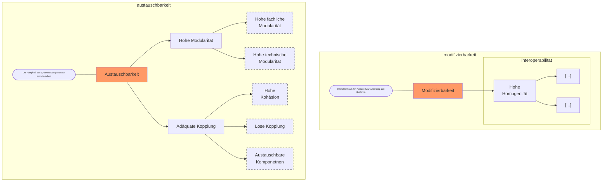
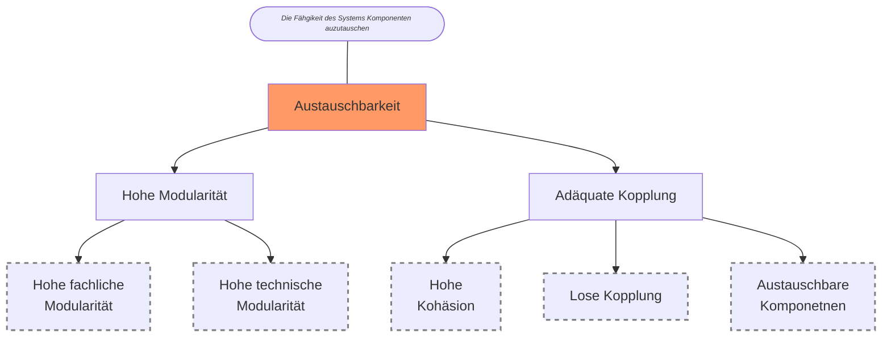
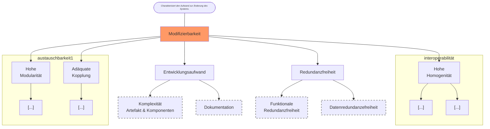
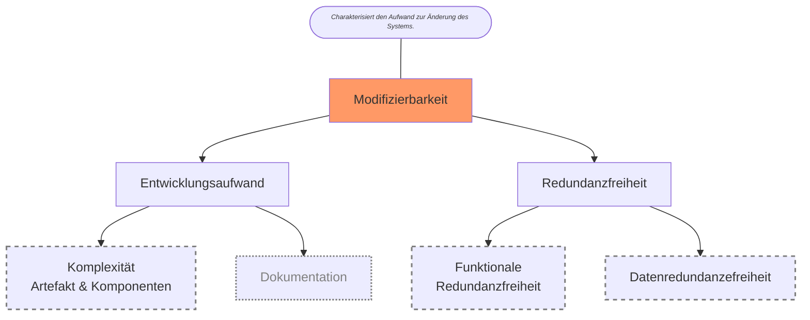
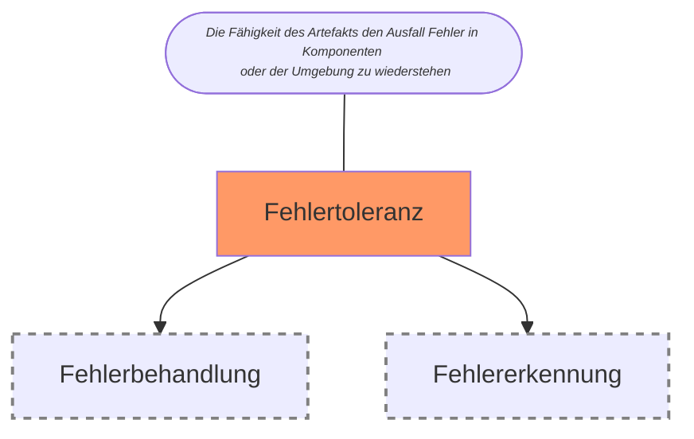
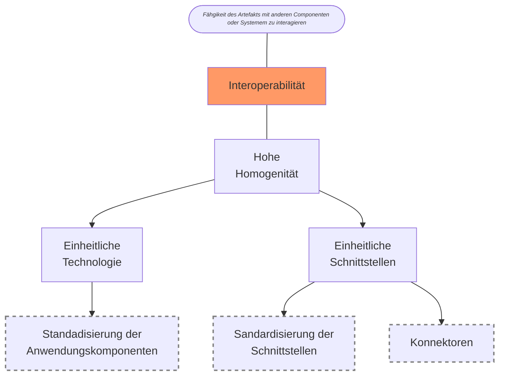
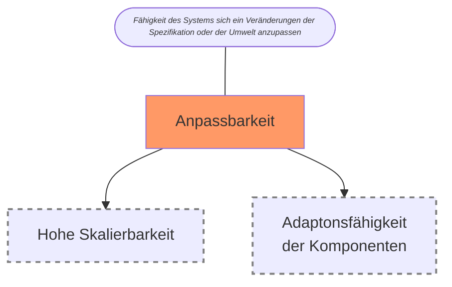

graph TD

subgraph interoperabilität
IN([Fähgikeit des Artefakts mit anderen Componenten oder Systemem zu interagieren]):::def ---INT[Interoperabilität]:::goal --- N
N[Hohe   Homogenität]
 N --> Q[Einheitl.    Technologie] --> SA[Standadisierung  der   Anwendungskomponenten]:::metric
  N --> R[Einheitl.   Schnittstellen] --> SS[Schnittstellenstandardisierung]:::metric 
  R --> K[Konnektoren]:::metric
end
subgraph anpassbarkeit
	ANPA([Fähigkeit des Systems sich ein Veränderungen der Spezifikation oder der Umwelt anzupassen]):::def 
end 
subgraph modifizierbarkeit
  DM([Charakterisiert den Aufwand zur Änderung des Systems.]):::def --- MO
  MO[Modifizierbarkeit]:::goal --> P[Adäquate Kopplung] --> KO[Hohe   Kohäsion]:::metric & LK[Lose Kopplung] & AK[Austauschbare   Komponetnen]
  AK:::metric 
  LK:::metric
end
subgraph tauglichkeit
	ANG([Angemessenheit der Funktionen der Software nach Spezifikation]):::def --- TAU[Tauglichkeit]:::goal --> VO[Vorhandenheit der   Anfoderungen]:::metric & AN[Angemessenheit der   Anforderungen]
	AN:::metric
end
subgraph fehlertolzeranz
	FEHL([Die Fähigkeit des Artefakts den Ausfall Fehler in Komponenten oder der Umgebung zu wiederstehen]):::def --- 
	FEH[Fehlertoleranz]:::goal --> Fehlerbehandlung:::metric
end
subgraph austauschbarkeit

end

classDef metric stroke:gray ,stroke-width:2px ,stroke-dasharray: 5, 5
classDef goal fill:#f96
classDef irr color: gray, stroke:gray, stroke-width:2px, stroke-dasharray: 2,10
classDef def font-style:italic, font-size: 80%

## Austauschbarkeit

## Modifizerbarkeit

## Modifizierbarkeit2

# Fehlertoleranz 

# Interoparabilität 

# Anpassbarkeit
