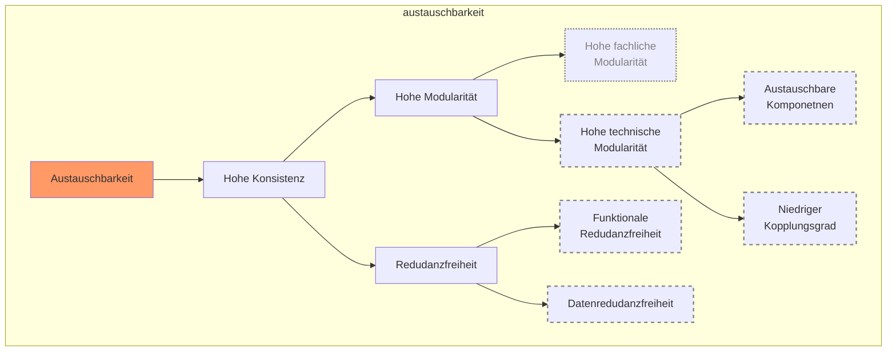
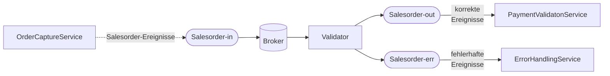

graph TD
  A[Austauschbarkeit] 
  A --> C[Hohe Konsistenz]
  C --> D[Hohe Modularität] --> E[Hohe fachliche <br> Modularität] 
  D --> F[Hohe technische  <br> Modularität]
  C --> H[Redudanzfreiheit] --> I[Funktionale <br> Redudanzfr.]
  H --> J[Datenredudanzfri.]

  K[Modifizierbarkeit] --> L[Geringe <br> Komplexität] --> M[Geringe <br> Abhängigkeiten] --> O[Geringe Vernetzung]
  L --> N[Hohe <br> Homogenität]
  M --> P[Adäquate Kipplung]
  N --> Q[Einheitl. <br>  Technologie]
  N --> R[Einheitl. <br> Schnittstellen]

  S[Anpassbarkeit] --> T[Hohe kapazitative Agilität] --> U[Hohe Skalierbarkeit]
  S --> Z[Adaptionsfähigkeit <br> der <br> Komponenten]
 

 V[Interoperatbiliät] --> W[Standartisierte <br> Anwendungskomponenten] 
 V --> Y[Vorhandenheit <br> Konnektoren] --> X[Schnittstellenstandardisierung]
 
 ![[4 🗄️ Archive/🎓 Bachelorarbeit 1/Bachelorarbeit/4/ZielhiarchieKennzahlen.png]]
 ![[4 🗄️ Archive/🎓 Bachelorarbeit 1/Bachelorarbeit/4/zh_modifizierbarkeit.jpeg]]
 
 ```mermaid
 graph TD

subgraph interoperabilität
Interoperabilität:::goal --- N
N[Hohe <br> Homogenität]
 N --> Q[Einheitl. <br>  Technologie] --> SA[Standadisierung  der <br> Anwendungskomponenten]:::metric
  N --> R[Einheitl. <br> Schnittstellen] --> SS[Schnittstellenstandardisierung]:::metric 
  R --> K[Konnektoren]:::metric
end
subgraph modifizierbarkeit
  Modifizierbarkeit:::goal --> L
  L[Geringe <br> Komplexität] --> M[Geringe <br> Abhängigkeiten] --> O[Geringe Vernetzung]:::metric
  L --> N
  M --> P[Adäquate Kopplung]:::metric

end
  


classDef metric stroke:gray ,stroke-width:2px ,stroke-dasharray: 5, 5
classDef goal fill:#f96

 ```
 


# Gesamtarchitektur
