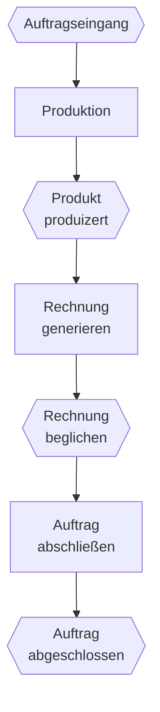

```mermaid
graph TD
		
    A{{Auftragseingang }} --> B
	B[Produktion] --> C
    C{{Produkt <br> produizert }} --> D
	D[Rechnung <br> generieren] --> E
	E{{Rechnung <br> beglichen}} --> F
	F[Auftrag <br> abschließen] --> G
	G{{Auftrag <br> abgeschlossen}}
					
```