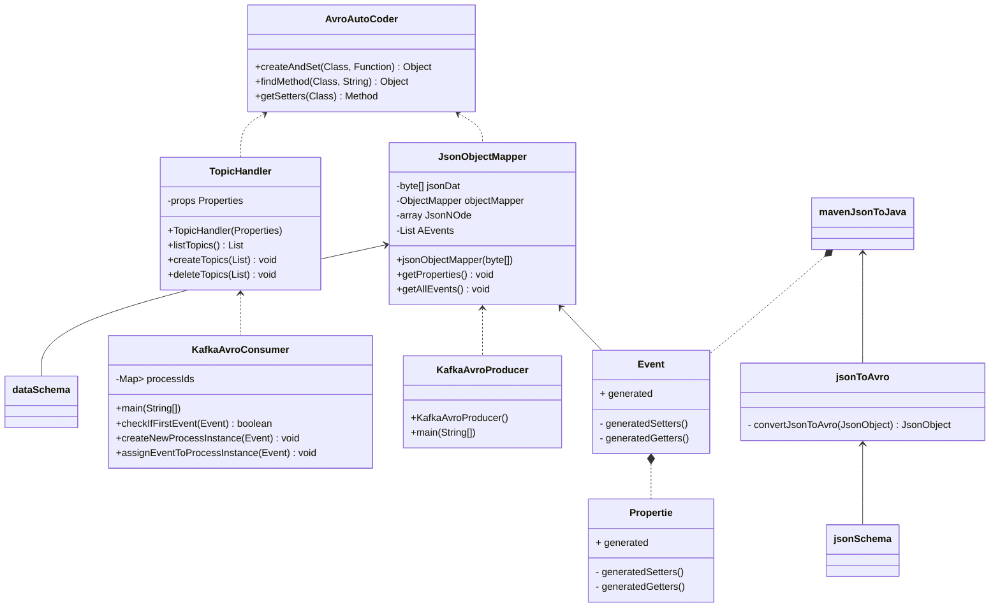

```mermaid
classDiagram
AvroAutoCoder <.. JsonObjectMapper
AvroAutoCoder <.. TopicHandler
JsonObjectMapper <-- dataSchema
TopicHandler <.. KafkaAvroConsumer
JsonObjectMapper <.. KafkaAvroProducer
JsonObjectMapper <-- Event
Event *.. Propertie
jsonToAvro <-- jsonSchema
mavenJsonToJava <-- jsonToAvro
mavenJsonToJava *.. Event

class AvroAutoCoder {
  +createAndSet(Class, Function<String, JsonNode>) Object
  +findMethod(Class, String) Object
  +getSetters(Class) Method
  }
class JsonObjectMapper{
  -byte[] jsonDat
  -ObjectMapper objectMapper
  -array JsonNOde
  -List<AEvent> AEvents
  +jsonObjectMapper(byte[])
  +getProperties() void
  +getAllEvents() void
}
class TopicHandler{
	-props Properties
	+TopicHandler(Properties)
  +listTopics() List<String>
  +createTopics(List<String>) void
  +deleteTopics(List<String>) void
}
class KafkaAvroProducer { 
  +KafkaAvroProducer()
  +main(String[])
}
class KafkaAvroConsumer { 
  -Map<Integer, List<Event>> processIds
  +main(String[])
  +checkIfFirstEvent(Event) boolean
  +createNewProcessInstance(Event) void
  +assignEventToProcessInstance(Event) void
}
class Event {
  + generated
  - generatedSetters()
  - generatedGetters()
}
class Propertie {
  + generated
  - generatedSetters()
  - generatedGetters()
}
class jsonSchema {
 
}
class dataSchema {
 
}
class jsonToAvro { 
  - convertJsonToAvro(JsonObject) JsonObject
}

class mavenJsonToJava {
 
}

```