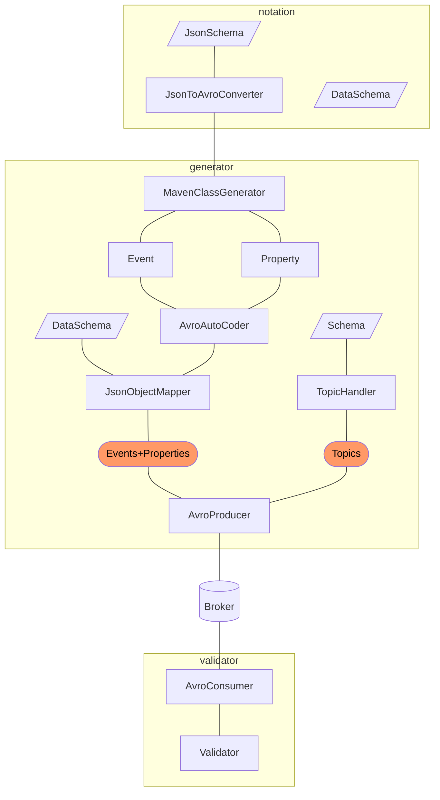

```mermaid
graph TB
    subgraph validator
    AvroConsumer --- Validator
    end
    subgraph generator
    Event 
    MavenClassGenerator --- Event & Property
    datas[/DataSchema/]  --- JsonObjectMapper
    AvroAutoCoder --- JsonObjectMapper --- obj([Events+Properties]):::obj --- AvroProducer
    Event & Property--- AvroAutoCoder 
    
    schem[/Schema/] --- TopicHandler --- top([Topics]):::obj --- AvroProducer
    end
    AvroProducer --- brok1[(Broker)] --- AvroConsumer
    subgraph notation
    jschema[/JsonSchema/] --- JsonToAvroConverter --- MavenClassGenerator
    datas2[/DataSchema/]
    end
    classDef obj fill:#f96, color:black;
```

