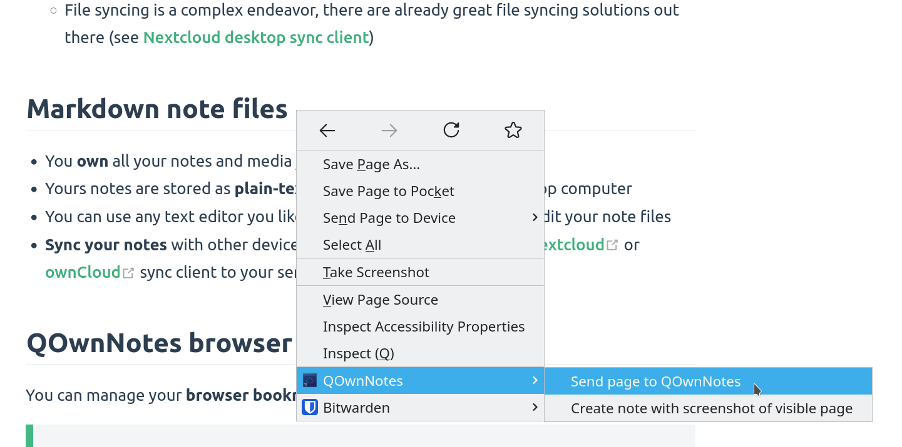
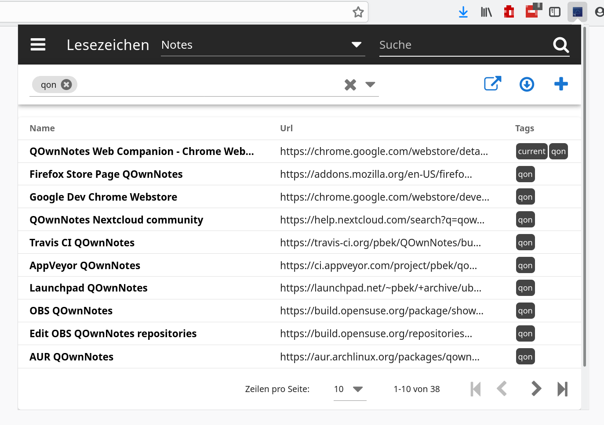

QOwnNotes Web Companion browser extension QOwnNotes
========================================


[https://www.qownnotes.org/getting-started/browser-extension.html](https://www.qownnotes.org/getting-started/browser-extension.html)


[* QOwnNotes](https://www.qownnotes.org/) 
```
[
Getting started
](https://www.qownnotes.org/getting-started/overview.html)[
Installation
](https://www.qownnotes.org/installation/)Contact Contact - [
Ask question
(opens new window)](https://github.com/pbek/QOwnNotes/issues#support)
- [
Ask for feature
(opens new window)](https://github.com/pbek/QOwnNotes/issues#feature)
- [
Report bug
(opens new window)](https://github.com/pbek/QOwnNotes/issues#bug)
- [
Telegram Channel
(opens new window)](https://t.me/QOwnNotes)
- [
Matrix/Element.io Room
(opens new window)](https://app.element.io/#/room/#qownnotes:matrix.org)
- [
Gitter Chat
(opens new window)](https://gitter.im/qownnotes/qownnotes)
- [
IRC Channel
(opens new window)](https://web.libera.chat/#qownnotes)
- [
Mastodon
(opens new window)](https://social.qownnotes.org/@qownnotes)
- [
Twitter
(opens new window)](https://twitter.com/QOwnNotes)
- [
Facebook
(opens new window)](https://www.facebook.com/QOwnNotes)
[
Donate
](https://www.qownnotes.org/contributing/donate.html)🌍 🌍 - [
English
](https://www.qownnotes.org/getting-started/browser-extension.html)
- [
Deutsch
](https://www.qownnotes.org/de/getting-started/browser-extension.html)
- [
Italiano
](https://www.qownnotes.org/it/getting-started/browser-extension.html)
- [
Français
](https://www.qownnotes.org/fr/getting-started/browser-extension.html)
- [
Español
](https://www.qownnotes.org/es/getting-started/browser-extension.html)
- [
فارسی
](https://www.qownnotes.org/fa/getting-started/browser-extension.html)
- [
Nederlands
](https://www.qownnotes.org/nl/getting-started/browser-extension.html)
- [
Magyar
](https://www.qownnotes.org/hu/getting-started/browser-extension.html)
- [
العربية
](https://www.qownnotes.org/ar/getting-started/browser-extension.html)
[
GitHub
(opens new window)](https://github.com/pbek/QOwnNotes) [
Getting started
](https://www.qownnotes.org/getting-started/overview.html)[
Installation
](https://www.qownnotes.org/installation/)Contact Contact - [
Ask question
(opens new window)](https://github.com/pbek/QOwnNotes/issues#support)
- [
Ask for feature
(opens new window)](https://github.com/pbek/QOwnNotes/issues#feature)
- [
Report bug
(opens new window)](https://github.com/pbek/QOwnNotes/issues#bug)
- [
Telegram Channel
(opens new window)](https://t.me/QOwnNotes)
- [
Matrix/Element.io Room
(opens new window)](https://app.element.io/#/room/#qownnotes:matrix.org)
- [
Gitter Chat
(opens new window)](https://gitter.im/qownnotes/qownnotes)
- [
IRC Channel
(opens new window)](https://web.libera.chat/#qownnotes)
- [
Mastodon
(opens new window)](https://social.qownnotes.org/@qownnotes)
- [
Twitter
(opens new window)](https://twitter.com/QOwnNotes)
- [
Facebook
(opens new window)](https://www.facebook.com/QOwnNotes)
[
Donate
](https://www.qownnotes.org/contributing/donate.html)🌍 🌍 - [
English
](https://www.qownnotes.org/getting-started/browser-extension.html)
- [
Deutsch
](https://www.qownnotes.org/de/getting-started/browser-extension.html)
- [
Italiano
](https://www.qownnotes.org/it/getting-started/browser-extension.html)
- [
Français
](https://www.qownnotes.org/fr/getting-started/browser-extension.html)
- [
Español
](https://www.qownnotes.org/es/getting-started/browser-extension.html)
- [
فارسی
](https://www.qownnotes.org/fa/getting-started/browser-extension.html)
- [
Nederlands
](https://www.qownnotes.org/nl/getting-started/browser-extension.html)
- [
Magyar
](https://www.qownnotes.org/hu/getting-started/browser-extension.html)
- [
العربية
](https://www.qownnotes.org/ar/getting-started/browser-extension.html)
[
GitHub
(opens new window)](https://github.com/pbek/QOwnNotes) - Getting started 

[Overview](https://www.qownnotes.org/getting-started/overview.html)
- [Concept](https://www.qownnotes.org/getting-started/concept.html)
- [QOwnNotes Demo](https://www.qownnotes.org/getting-started/demo.html)
- [Markdown](https://www.qownnotes.org/getting-started/markdown.html)
- [Importing notes](https://www.qownnotes.org/getting-started/importing-notes.html)
- [Command line interface parameters](https://www.qownnotes.org/getting-started/cli-parameters.html)
- [QOwnNotes Web Companion browser extension](https://www.qownnotes.org/getting-started/browser-extension.html)[Installation](https://www.qownnotes.org/getting-started/browser-extension.html#installation)
- [Web clipper](https://www.qownnotes.org/getting-started/browser-extension.html#web-clipper)
- [Bookmarks](https://www.qownnotes.org/getting-started/browser-extension.html#bookmarks)
- [Command-line Snippet Manager](https://www.qownnotes.org/getting-started/command-line-snippet-manager.html)
- [QOwnNotes Web App](https://www.qownnotes.org/getting-started/web-app.html)
- [QOwnNotesAPI Nextcloud App](https://www.qownnotes.org/getting-started/qownnotesapi.html)
- [Searching for notes](https://www.qownnotes.org/getting-started/searching.html)
- [Shortcuts](https://www.qownnotes.org/getting-started/shortcuts.html)
- 

Installation 


- 

Editor 


- 

Scripting 


- 

Contributing 


- 

FAQ 


- 

Blog 


- 

Changelog 


# [#](https://www.qownnotes.org/getting-started/#qownnotes-web-companion-browser-extension) QOwnNotes Web Companion browser extension


Allows for clipping from a browser page and managing browser bookmarks across browsers and operating systems.


Info

- QOwnNotes must be running for the Web Companion browser extension to work.
- No internet connection needed. The browser extensions works **offline**.

## [#](https://www.qownnotes.org/getting-started/#installation) Installation
- Get the extension
[Chrome Web Store

(opens new window)](https://chrome.google.com/webstore/detail/qownnotes-web-companion/pkgkfnampapjbopomdpnkckbjdnpkbkp)
- [Firefox Add-ons page (opens new window)](https://addons.mozilla.org/firefox/addon/qownnotes-web-companion)
- You can also find the extension on [GitHub (opens new window)](https://github.com/qownnotes/web-companion/).
- Add the Security Token to configure the extension.
The first time you click on the QOwnNotes browser extension icon you will receive a dialog box with a security token. Copy the token.
- Go to your browser's extension management location. Click into the QOwnNotes extension details.
- Paste the token into the Security Token field.

## [#](https://www.qownnotes.org/getting-started/#web-clipper) Web clipper



Right-click on a webpage or selected text to use the **web-clipper** functionality. There you can also create a new note with a **screenshot** of the current webpage.


TIP


The web clipper is also scriptable! Take a look at the [websocketRawDataHook](https://www.qownnotes.org/scripting/hooks.html#websocketrawdatahook) if you want to control what you clip from webpages.


## [#](https://www.qownnotes.org/getting-started/#bookmarks) Bookmarks





If you want full control over your browser bookmarks and **use them across different browsers and operating systems** then the QOwnNotes browser extension is for you.


By default the browser extension will show all **links of the current note** in a popup when you click the QOwnNotes icon in your browser. These links will get a tag 
```
current
```
.


You can also **manage your bookmarks in notes** with the note tag 
```
bookmarks
```
(changeable in the settings). These links can also have tags and a description that will be shown in the browser extension.


New bookmarks are stored in a note called 
```
Bookmarks
```
(also changeable in the settings).


TIP


You can also import your browser bookmarks into QOwnNotes with the web companion browser extension!


### [#](https://www.qownnotes.org/getting-started/#syntax-of-bookmark-links) Syntax of bookmark links


```
- [Webpage name](https://www.example.com)
- [Webpage name](https://www.example.com) #tag1 #tag2
- [Webpage name](https://www.example.com) some description only
- [Webpage name](https://www.example.com) #tag1 #tag2 some description and tags
* [Webpage name](https://www.example.com) the alternative list character also works

```

Copied!

```
1
2
3
4
5
You are able to search for name, url tags or description in the browser extension.

[Help us improve this page!](https://github.com/pbek/QOwnNotes/edit/develop/webpage/src/getting-started/browser-extension.md) 

(opens new window) Last Updated: 7/26/2022, 5:38:25 PM 
←
[
Command line interface parameters
](https://www.qownnotes.org/getting-started/cli-parameters.html) [
Command-line Snippet Manager
](https://www.qownnotes.org/getting-started/command-line-snippet-manager.html)
→


Made by [Patrizio Bekerle](https://www.keybase.io/pbek) with ❤️
[*](https://github.com/pbek/QOwnNotes) [*](https://twitter.com/QOwnNotes) [*](https://www.facebook.com/QOwnNotes) How did you find out about QOwnNotes?*0 / 200 
Submit
* 
Thank you for letting us know!